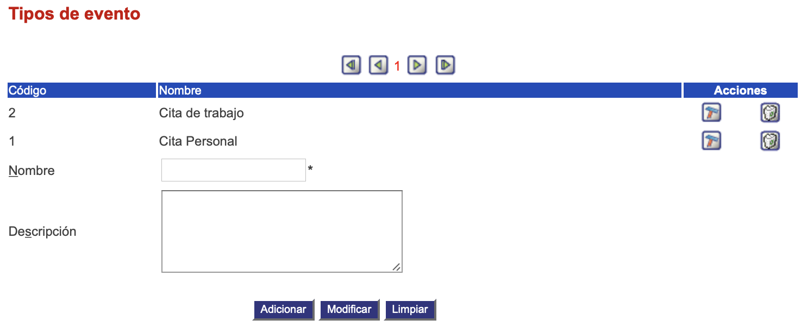

################
Tipos de evento
################

La condición del usuario se refiere a la situación actual del usuario.

.. |advertencia| image:: ../../../img/alerta.png
.. |modificar| image:: ../../../img/reg_modificar_boton.jpg
.. |eliminar| image:: ../../../img/eliminar.png

+---------------+------------------------------------------------------------------------+
||advertencia|  | **Nota:**  Los campos acompañados por un asterisco ( * ) son de        | 
|               |                                                                        |
|               |  carácter obligatorio.                                                 |
+---------------+------------------------------------------------------------------------+

Para diligenciar esta sección, siga los pasos indicados a continuación:

1. Ingrese a la opción **"Agenda > Configuración de agenda > Tipos de evento"** del árbol de 
   opciones que se encuentra a la izquierda de la pantalla. Esta acción mostrará en 
   pantalla el siguiente formulario:

+--------------------+---------------------------------------------------------------------+
|Campo 	             | Descripción                                                         |
+====================+=====================================================================+
|Nombre              | Asigne un nombre para identificar el tipo del evento.               |
|                    |                                                                     |
+--------------------+---------------------------------------------------------------------+
|Descripción         | Realice una descripción de las características del tipo del         |
|                    | evento.                                                             |
+--------------------+---------------------------------------------------------------------+

2. Digite o seleccione la información requerida.

3. Para terminar presione el botón "Aceptar" o pulse el botón "Limpiar" para cancelar esta 
   acción y empezar de nuevo.

4. Adicionalmente, aparece en la parte superior, la lista de todos los tipos eventos los cuáles se pueden modificar o eliminar,
presionando el botón |modificar| o |eliminar|.
 

