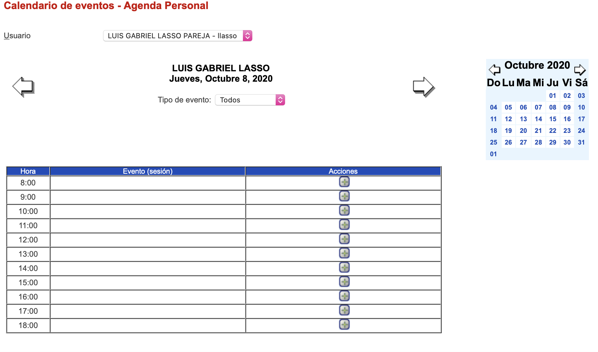
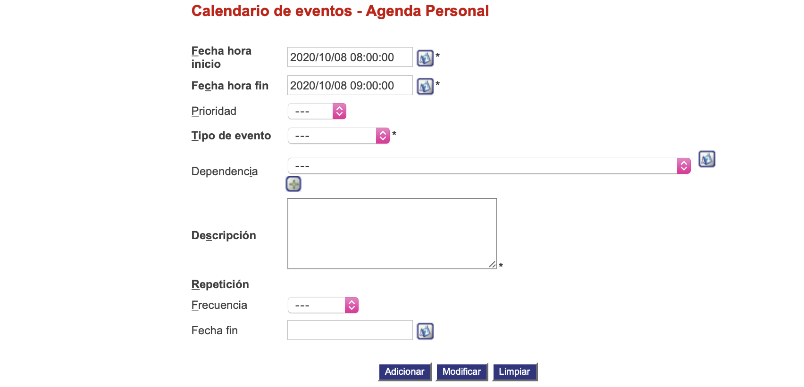

####################
Registrar pacientes
####################

Esta funcionalidad permite asignar a cada hora del día actual un evento.

.. |advertencia| image:: ../../../img/alerta.png
.. |servicio| image:: ../../../img/servicio.png
.. |mas| image:: ../../../img/boton_req_adic.jpg
.. |fecha| image:: ../../../img/fecha.png

+---------------+------------------------------------------------------------------------+
||advertencia|  | **Nota:**  Los campos acompañados por un asterisco ( * ) son de        | 
|               |                                                                        |
|               |  carácter obligatorio.                                                 |
+---------------+------------------------------------------------------------------------+

Para diligenciar esta sección, siga los pasos indicados a continuación:

1. Ingrese a la opción **"Agenda > Registro > Calendario de eventos"** del árbol de opciones que se 
   encuentra a la izquierda de la pantalla. Esta acción mostrará en pantalla el siguiente 
   formulario:

+--------------------+---------------------------------------------------------------------+
|Campo               | Descripción                                                         |
+====================+=====================================================================+
|Usuario             | En el campo, aparecera el nombre de su usuario.                     |
|                    |                                                                     |
+--------------------+---------------------------------------------------------------------+
|Tipo de evento      | Seleccione de la lista existente, el tipo de evento, por Ej:        |
|                    | "Todos", "Cita de trabajo o "Cita personal".                        |
+--------------------+---------------------------------------------------------------------+

2. Digite o seleccione la información requerida.

3. Para añadir un evento a una hora especifica del día, seleccione el botón |mas|.

4. A continuación saldrá la siguiente pantalla:

+--------------------+---------------------------------------------------------------------+
|Campo               | Descripción                                                         |
+====================+=====================================================================+
|Fecha hora inicio   | Seleccione usando el botón |fecha| la fecha de hora inical.         |
|                    |                                                                     |
+--------------------+---------------------------------------------------------------------+
|Fecha hora fin      | Seleccione usando el botón |fecha| la fecha de hora final.          |
|                    |                                                                     |
+--------------------+---------------------------------------------------------------------+
|Prioridad           | Seleccione de la lista existente, el tipo de prioridad, por Ej:     |
|                    | "Alta","Media" o "Baja".                                            |
+--------------------+---------------------------------------------------------------------+
|Tipo de evento      | Seleccione de la lista existente, el tipo de evento, por Ej:        |
|                    | "Cita de trabajo" o "Cita personal".                                |
+--------------------+---------------------------------------------------------------------+
|Dependencia         | Seleccione de la lista existente el tipo de dependencia, y          |
|                    | presionando el botón |mas| añadira esta dependencia y aparecera     |
|                    | al lado derecho en forma de una tabla.                              |
+--------------------+---------------------------------------------------------------------+
|Descripción         | Escriba una pequeña descripción del tipo de evento de esa hora.     |
|                    |                                                                     |
+--------------------+---------------------------------------------------------------------+
|Frecuencia          | Seleccione de la lista existente, la frecuencia del evento, por Ej: |
|                    | "Diaria", "Semanal","Mensual" o "Anual".                            |
+--------------------+---------------------------------------------------------------------+
|Fecha fin           | Seleccione usando el botón |fecha| la fecha de hora final.          |
|                    |                                                                     |
+--------------------+---------------------------------------------------------------------+

5. Digite o seleccione la información requerida.

6. Para terminar presione el botón "Adicionar" o pulse el botón "Limpiar" para cancelar esta 
   acción y empezar de nuevo.
