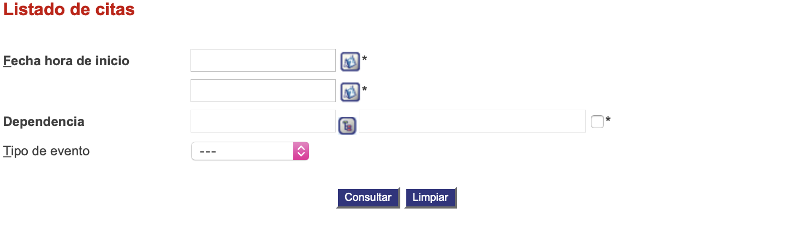

####################
Listado de citas
####################

Esta funcionalidad permite visualizar el listado de citas del usuario.

.. |advertencia| image:: ../../../img/alerta.png
.. |servicio| image:: ../../../img/servicio.png
.. |fecha| image:: ../../../img/fecha.png

+---------------+------------------------------------------------------------------------+
||advertencia|  | **Nota:**  Los campos acompañados por un asterisco ( * ) son de        | 
|               |                                                                        |
|               |  carácter obligatorio.                                                 |
+---------------+------------------------------------------------------------------------+

Para diligenciar esta sección, siga los pasos indicados a continuación:

1. Ingrese a la opción **"Agenda > Reporte y listados > Listado de citas"** del árbol de opciones que se 
   encuentra a la izquierda de la pantalla. Esta acción mostrará en pantalla el siguiente 
   formulario:

+--------------------+---------------------------------------------------------------------+
|Campo               | Descripción                                                         |
+====================+=====================================================================+
|Fecha hora inicio   | Seleccione usando el botón |fecha| la fecha de hora inical y la     |
|                    | fecha fin.                                                          |
+--------------------+---------------------------------------------------------------------+
|Dependencia         | Digite la dependencia presionando el botón |servicio|.              |
|                    |                                                                     |
+--------------------+---------------------------------------------------------------------+
|Tipo de evento      | Seleccione de la lista existente, el tipo de evento, por Ej:        |
|                    | "Cita de trabajo" o "Cita personal".                                |
+--------------------+---------------------------------------------------------------------+

2. Digite o seleccione la información requerida.

3. Para terminar presione el botón "Consultar" o pulse el botón "Limpiar" para cancelar esta 
   acción y empezar de nuevo.