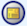

#######################
Centro de reportes
#######################

.. |info| image:: ../../../img/informacion.png
.. |advertencia| image:: ../../../img/alerta.png

.. |fecha| image:: ../../../img/fecha.png
.. |servicio| image:: ../../../img/servicio.png

 En la consulta de soluciones es posible navegar por las soluciones hechas a los casos finalizados, las soluciones están dispuestas por tipos y clasificaciones.

+---------------+------------------------------------------------------------------------+
||advertencia|  | **Nota:**  Los campos acompañados por un asterisco ( * ) son de        | 
|               |                                                                        |
|               |  carácter obligatorio.                                                 |
+---------------+------------------------------------------------------------------------+

1. Ingrese a la opción **"Casos > Reporte y listados > Centro de reportes"** del árbol de 
   opciones que se encuentra a la izquierda de la pantalla. Esta acción mostrará la 
   siguiente pantalla:

   .. image:: ../../../img/centro_reportes.png
    :alt: Centro de reportes

2. Para consultar los reportes, seleccione el botón |abrir|.

3. Para el modulo Cantidad de casos por frecuencia (horario, diario, semanal, mensual) aparecerá la siguiente pantalla:

   .. image:: ../../../img/cantidad_casos.png
    :alt: Centro de reportes

+--------------------+---------------------------------------------------------------------+
|Campo 	             | Descripción                                                         |
+====================+=====================================================================+
| Año                | Digite el año el cuál desea se incluya en la busqueda del reporte.  |
|                    |                                                                     |
+--------------------+---------------------------------------------------------------------+
| Periodo            | Seleccione de la lista existente, el periodo que desea consultar.   |
|                    |                                                                     |
+--------------------+---------------------------------------------------------------------+
| Mes                | Seleccione de la lista, el més del año que desea consultar.         |
|                    |                                                                     |
+--------------------+---------------------------------------------------------------------+
| Frecuencia         | Seleccione de la lista, la frecuencia de tiempo que desea consultar.|
|                    |                                                                     |
+--------------------+---------------------------------------------------------------------+
| Tipo de caso       | Seleccione de la lista existente el tipo de caso el cuál            |
|                    | desea consultar.                                                    |
+--------------------+---------------------------------------------------------------------+
| Dependencia        | Seleccione de la lista la dependencia encargada de diligenciar el   |
|                    | caso utilizando el botón |servicio|                                 |
+--------------------+---------------------------------------------------------------------+

4. Para el modulo Actividades por tarea aparecerá la siguiente pantalla:

   .. image:: ../../../img/actividades_tarea.png
    :alt: Centro de reportes

+--------------------+---------------------------------------------------------------------+
|Campo 	             | Descripción                                                         |
+====================+=====================================================================+
| Fecha registro     | Seleccione usando el botón |fecha| la fecha de registro inical.     |
| inicial            |                                                                     |
+--------------------+---------------------------------------------------------------------+
| Fecha registro     | Seleccione usando el botón |fecha| la fecha de registro final.      |
| final              |                                                                     |
+--------------------+---------------------------------------------------------------------+
| Grafico            | Seleccione de la lista existente, el tipo de grafico en el cuál     |
|                    | desea ver la información.                                           |
+--------------------+---------------------------------------------------------------------+
| Dependencia        | Seleccione de la lista la dependencia encargada de diligenciar el   |
|                    | caso utilizando el botón |servicio|                                 |
+--------------------+---------------------------------------------------------------------+

5. Para el modulo Cantidad de Casos por usuario aparecerá la siguiente pantalla:

   .. image:: ../../../img/cantidad_usuarios.png
    :alt: Centro de reportes

+--------------------+---------------------------------------------------------------------+
|Campo 	             | Descripción                                                         |
+====================+=====================================================================+
| Fecha registro     | Seleccione usando el botón |fecha| la fecha de registro inical.     |
| inicial            |                                                                     |
+--------------------+---------------------------------------------------------------------+
| Fecha registro     | Seleccione usando el botón |fecha| la fecha de registro final.      |
| final              |                                                                     |
+--------------------+---------------------------------------------------------------------+
| Fecha-hora         | Seleccione usando el botón |fecha| la fecha-hora de digitación      |
| digitacion inicial | inicial.                                                            |
+--------------------+---------------------------------------------------------------------+
| Fecha-hora         | Seleccione usando el botón |fecha| la fecha-hora de digitación      |
| digitacion final   | final.                                                              |
+--------------------+---------------------------------------------------------------------+
| Grafico            | Seleccione de la lista existente, el tipo de grafico en el cuál     |
|                    | desea ver la información.                                           |
+--------------------+---------------------------------------------------------------------+

6. Para el modulo Histórico de rotación de personal aparecerá la siguiente pantalla:

   .. image:: ../../../img/historica.png
    :alt: Centro de reportes

+--------------------+---------------------------------------------------------------------+
|Campo 	             | Descripción                                                         |
+====================+=====================================================================+
| Fecha registro     | Seleccione usando el botón |fecha| la fecha de registro inical.     |
| inicial            |                                                                     |
+--------------------+---------------------------------------------------------------------+
| Fecha registro     | Seleccione usando el botón |fecha| la fecha de registro final.      |
| final              |                                                                     |
+--------------------+---------------------------------------------------------------------+
| Fecha-hora         | Seleccione usando el botón |fecha| la fecha-hora de digitación      |
| digitacion inicial | inicial.                                                            |
+--------------------+---------------------------------------------------------------------+
| Fecha-hora         | Seleccione usando el botón |fecha| la fecha-hora de digitación      |
| digitacion final   | final.                                                              |
+--------------------+---------------------------------------------------------------------+

7. Para el modulo Reporte de autorizaciones aparecerá la siguiente pantalla:

   .. image:: ../../../img/autorizaciones.png
    :alt: Centro de reportes

+--------------------+---------------------------------------------------------------------+
|Campo 	             | Descripción                                                         |
+====================+=====================================================================+
| Fecha registro     | Seleccione usando el botón |fecha| la fecha de registro inical.     |
| inicial            |                                                                     |
+--------------------+---------------------------------------------------------------------+
| Fecha registro     | Seleccione usando el botón |fecha| la fecha de registro final.      |
| final              |                                                                     |
+--------------------+---------------------------------------------------------------------+
| Usuario que        | Seleccione el usuario que autoriza.                                 |
| autoriza           |                                                                     |
+--------------------+---------------------------------------------------------------------+
| Usuario que        | Seleccione el usuario que solicita.                                 |
| solicita           |                                                                     | 
+--------------------+---------------------------------------------------------------------+

8. Digite la información requerida.

9. Para terminar presione el botón "Aceptar".
