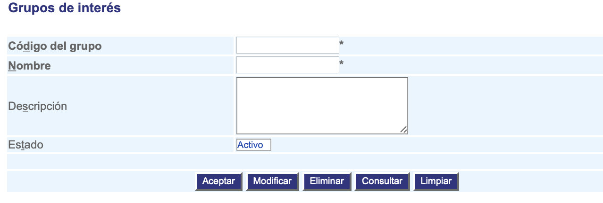

############################
Grupos de interes
############################

+---------------+------------------------------------------------------------------------+
||advertencia|  | **Nota:**  Los campos acompañados por un asterisco ( * ) son de        | 
|               |                                                                        |
|               |  carácter obligatorio.                                                 |
+---------------+------------------------------------------------------------------------+

Para diligenciar esta sección, siga los pasos indicados a continuación:

1. Ingrese a la opción **"Pacientes/reclamantes > Configuración > Grupos de interes"** del árbol de 
   opciones que se encuentra a la izquierda de la pantalla. Esta acción mostrará en 
   pantalla el siguiente formulario:

+--------------------+---------------------------------------------------------------------+
|Campo 	             | Descripción                                                         |
+====================+=====================================================================+
|Código              | Ingrese un código para identificar el estado del grupo.             |
|                    |                                                                     |
+--------------------+---------------------------------------------------------------------+
|Nombre              | Asigne un nombre para identificar el estado del grupo.              |
|                    |                                                                     |
+--------------------+---------------------------------------------------------------------+
|Descripción         | Realice una descripción de las características del estado del       |
|                    | grupo.                                                              |
+--------------------+---------------------------------------------------------------------+
|Estado              | Seleccione de la lista, si el estado del grupo va a estar en        |
|                    | estado "Activo" o "Inactivo".                                       |
+--------------------+---------------------------------------------------------------------+

2. Digite o seleccione la información requerida.

3. Para terminar presione el botón "Aceptar" o pulse el botón "Limpiar" para cancelar esta 
   acción y empezar de nuevo.
