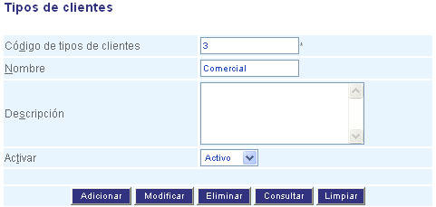

###########################
Configurar Tipos de cliente
###########################

Esta funcionalidad permite la administración de los tipos de cliente.

Para diligenciar esta sección, siga los pasos indicados a continuación:

.. |advertencia| image:: ../../../img/alerta.png

+---------------+------------------------------------------------------------------------+
||advertencia|  | **Nota:**  Los campos acompañados por un asterisco ( * ) son de        | 
|               |                                                                        |
|               |  carácter obligatorio.                                                 |
+---------------+------------------------------------------------------------------------+

1. Ingrese a la opción **"Clientes > Configuración > Tipos de cliente"** del árbol de 
   opciones que se encuentra a la izquierda de la pantalla. Esta acción mostrará en 
   pantalla el siguiente formulario:

+--------------------+---------------------------------------------------------------------+
|Campo               | Descripción                                                         |
+====================+=====================================================================+
|Código de tipos de  | Ingrese un código para identificar el tipo de cliente.              |
|cliente             |                                                                     |
+--------------------+---------------------------------------------------------------------+
|Nombre              | Asigne un nombre para identificar el tipo de cliente.               |
|                    |                                                                     |
+--------------------+---------------------------------------------------------------------+
|Descripción         | Realice una descripción de las características del tipo de cliente. |
|                    |                                                                     |
+--------------------+---------------------------------------------------------------------+
|Estado              | Seleccione de la lista, si el tipo de cliente va a estar en estado  |
|                    | "Activo" o "Inactivo".                                              |
+--------------------+---------------------------------------------------------------------+

2. Digite o seleccione la información requerida.

3. Para terminar presione el botón "Aceptar" o pulse el botón "Limpiar" para cancelar esta 
   acción y empezar de nuevo.
