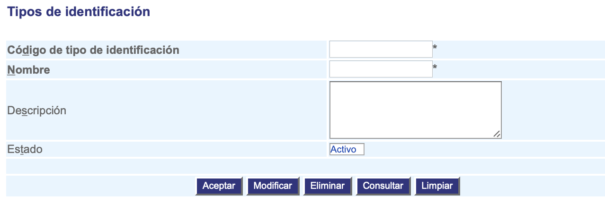

##################################
Configurar Tipos de identificación
##################################

Esta funcionalidad permite la administración de los tipos de identificación que van a tener 
los usuarios en la aplicación.

.. |advertencia| image:: ../../../img/alerta.png

+---------------+------------------------------------------------------------------------+
||advertencia|  | **Nota:**  Los campos acompañados por un asterisco ( * ) son de        | 
|               |                                                                        |
|               |  carácter obligatorio.                                                 |
+---------------+------------------------------------------------------------------------+
Para diligenciar esta sección, siga los pasos indicados a continuación:

1. Ingrese a la opción **"Pacientes/reclamantes > Configuración > Tipos de identificación"** del árbol 
   de opciones que se encuentra a la izquierda de la pantalla. Esta acción mostrará en 
   pantalla el siguiente formulario:

+--------------------+---------------------------------------------------------------------+
|Campo 	             | Descripción                                                         |
+====================+=====================================================================+
|Código del tipo de  | Ingrese un código para identificar el tipo de identificación.       |
|identificación      |                                                                     |
+--------------------+---------------------------------------------------------------------+
|Nombre              | Asigne un nombre para identificar el tipo de identificación.        |
|                    |                                                                     |
+--------------------+---------------------------------------------------------------------+
|Descripción         | Realice una descripción de las características del tipo de          |
|                    | identificación.                                                     |
+--------------------+---------------------------------------------------------------------+
|Estado              | Seleccione de la lista, si el tipo de identificación va a estar en  |
|                    | estado "Activo" o "Inactivo".                                       |
+--------------------+---------------------------------------------------------------------+
    
2. Digite o seleccione la información requerida.

3. Para terminar presione el botón "Aceptar" o pulse el botón "Limpiar" para cancelar esta 
   acción y empezar de nuevo.
