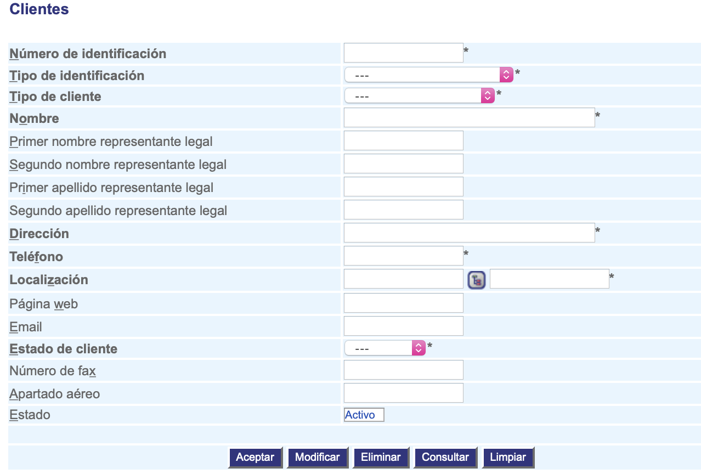

##################
Registrar clientes
##################

Esta funcionalidad permite registrar la información del cliente.

.. |advertencia| image:: ../../../img/alerta.png
.. |servicio| image:: ../../../img/servicio.png

+---------------+------------------------------------------------------------------------+
||advertencia|  | **Nota:**  Los campos acompañados por un asterisco ( * ) son de        | 
|               |                                                                        |
|               |  carácter obligatorio.                                                 |
+---------------+------------------------------------------------------------------------+

Para diligenciar esta sección, siga los pasos indicados a continuación:

1. Ingrese a la opción **"Pacientes/reclamantes > Registro > Clientes"** del árbol de opciones que se 
   encuentra a la izquierda de la pantalla. Esta acción mostrará en pantalla el siguiente 
   formulario:

+--------------------+---------------------------------------------------------------------+
|Campo               | Descripción                                                         |
+====================+=====================================================================+
|Número de           | Asigne un número de idenficación del cliente.                       |
|identificación      |                                                                     |
+--------------------+---------------------------------------------------------------------+
|Tipo de             | Asigne de la lista existente, el tipo  de idenficación del cliente. |
|identificación      |                                                                     |
+--------------------+---------------------------------------------------------------------+
|Tipo de cliente     | Seleccione de la lista el tipo de cliente: comercial, industrial,   |
|                    | residencial, etc.                                                   |
+--------------------+---------------------------------------------------------------------+
|Nombre              | Ingrese el nombre o razón social del cliente.                       |
|                    |                                                                     |
+--------------------+---------------------------------------------------------------------+
|Primer nombre       |  Ingrese el primer nombre del representante legal.                  |
|representante legal |                                                                     |
+--------------------+---------------------------------------------------------------------+
|Segundo nombre      |  Ingrese el segundo nombre del representante legal si tiene.        |
|representante legal |                                                                     |
+--------------------+---------------------------------------------------------------------+
|Primer apellido     |  Ingrese el primer apellido del representante legal.                |
|representante legal |                                                                     |
+--------------------+---------------------------------------------------------------------+
|Segundo apellido    |  Ingrese el segundo apellido del representante legal.               |
|representante legal |                                                                     |
+--------------------+---------------------------------------------------------------------+
|Dirección           | En este campo ingrese la dirección del cliente.                     |
|                    |                                                                     |
+--------------------+---------------------------------------------------------------------+
|Teléfono            | Registre el número de teléfono del cliente.                         |
|                    |                                                                     |
+--------------------+---------------------------------------------------------------------+
|Localización        | Seleccione de la lista la localización del cliente utilizando el    |
|                    | botón |servicio|.                                                   |
+--------------------+---------------------------------------------------------------------+
|Página web          | Si el cliente dispone de página web, regístrela en este campo.      |
|                    |                                                                     |
+--------------------+---------------------------------------------------------------------+
|E-mail              | Ingrese el correo electrónico del cliente.                          |
|                    |                                                                     |
+--------------------+---------------------------------------------------------------------+
|Estado del cliente  | Seleccione de la lista, si el estado del cliente va a estar         |
|                    | "Activo", "Inactivo", "Moroso", etc.                                |
+--------------------+---------------------------------------------------------------------+
|Número de fax       | Ingrese el número de fax del cliente.                               |
|                    |                                                                     |
+--------------------+---------------------------------------------------------------------+
|Apartado aéreo      | Registre el número del apartado aéreo.                              |
|                    |                                                                     |
+--------------------+---------------------------------------------------------------------+
|Estado              | Seleccione de la lista, si el cliente va a estar en estado "Activo" |
|                    | o "Inactivo".                                                       |
+--------------------+---------------------------------------------------------------------+

2. Digite o seleccione la información requerida.

3. Para terminar presione el botón "Aceptar" o pulse el botón "Limpiar" para cancelar esta 
   acción y empezar de nuevo.