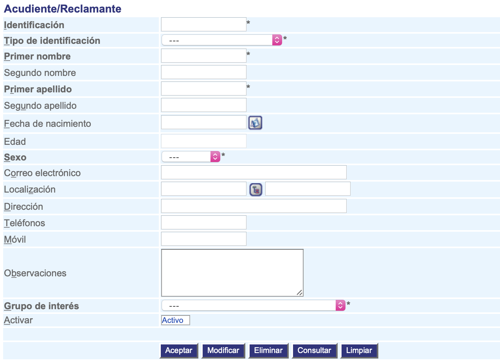

######################
Registrar reclamantes
######################

Esta funcionalidad permite registrar la información del reclamante.

.. |advertencia| image:: ../../../img/alerta.png
.. |servicio| image:: ../../../img/servicio.png
.. |fecha| image:: ../../../img/fecha.png

+---------------+------------------------------------------------------------------------+
||advertencia|  | **Nota:**  Los campos acompañados por un asterisco ( * ) son de        | 
|               |                                                                        |
|               |  carácter obligatorio.                                                 |
+---------------+------------------------------------------------------------------------+

Para diligenciar esta sección, siga los pasos indicados a continuación:

1. Ingrese a la opción **"Pacientes/reclamantes > Registro > Reclamantes"** del árbol de opciones que se 
   encuentra a la izquierda de la pantalla. Esta acción mostrará en pantalla el siguiente 
   formulario:

+--------------------+---------------------------------------------------------------------+
|Campo               | Descripción                                                         |
+====================+=====================================================================+
|Número de           | Asigne un número de idenficación del reclamante.                    |
|identificación      |                                                                     |
+--------------------+---------------------------------------------------------------------+
|Tipo de             | Asigne de la lista existente, el tipo de idenficación del           |
|identificación      | reclamante.                                                         |
+--------------------+---------------------------------------------------------------------+
|Primer nombre       |  Ingrese el primer nombre del reclamante.                           |
|                    |                                                                     |
+--------------------+---------------------------------------------------------------------+
|Segundo nombre      |  Ingrese el segundo nombre del reclamante si tiene.                 |
|                    |                                                                     |
+--------------------+---------------------------------------------------------------------+
|Primer apellido     |  Ingrese el primer apellido del reclamante.                         |
|                    |                                                                     |
+--------------------+---------------------------------------------------------------------+
|Segundo apellido    |  Ingrese el segundo apellido del reclamante.                        |
|                    |                                                                     |
+--------------------+---------------------------------------------------------------------+
|Fecha de            |  Ingrese la fecha de nacimiento del reclamante utilizando el botón  |
|nacimiento          |  |fecha|.                                                           |
+--------------------+---------------------------------------------------------------------+
|Edad                | Digite la edad del reclamante.                                      |  
|                    |                                                                     |
+--------------------+---------------------------------------------------------------------+
|Sexo                | Seleccione de la lista, si el reclamante es de sexo "Femenino"      |
|                    | o "Masculino".                                                      |
+--------------------+---------------------------------------------------------------------+
|E-mail              | Ingrese el correo electrónico del reclamante.                       |
|                    |                                                                     |
+--------------------+---------------------------------------------------------------------+
|Localización        | Seleccione de la lista la localización del reclamante utilizando el |
|                    | botón |servicio|.                                                   |
+--------------------+---------------------------------------------------------------------+
|Dirección           | En este campo ingrese la dirección del reclamante.                  |
|                    |                                                                     |
+--------------------+---------------------------------------------------------------------+
|Teléfono            | Registre el número de teléfono del reclamante.                      |
|                    |                                                                     |
+--------------------+---------------------------------------------------------------------+
|Movil               | Registre el número de movil del reclamante.                         |
|                    |                                                                     |
+--------------------+---------------------------------------------------------------------+
|Observaciones       | Campo para escribir observaciones si se tienen.                     |
|                    |                                                                     |
+--------------------+---------------------------------------------------------------------+
|Grupo de interes    | Seleccione de la lista existente, el grupo de interes.              |
|                    |                                                                     |
+--------------------+---------------------------------------------------------------------+
|Estado              | Seleccione de la lista, si el cliente va a estar en estado "Activo" |
|                    | o "Inactivo".                                                       |
+--------------------+---------------------------------------------------------------------+

2. Digite o seleccione la información requerida.

3. Para terminar presione el botón "Aceptar" o pulse el botón "Limpiar" para cancelar esta 
   acción y empezar de nuevo.