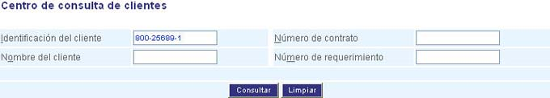
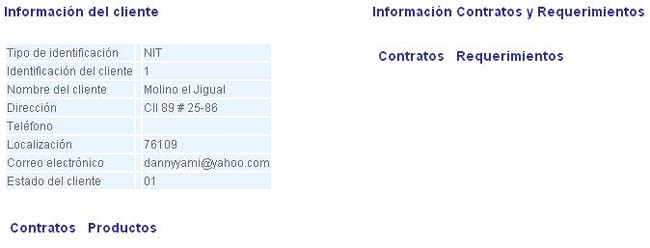

##############################
Centro de consulta de clientes
##############################

Esta funcionalidad le permite consultar toda la información de un cliente a través del 
Centro de Consulta. Puede digitar el número de identificación del cliente y/o el número de 
identificación del contrato para consultas más específicas. Adicionalmente se puede 
consultar por número de requerimiento.

Para diligenciar esta sección, siga los pasos indicados a continuación:

.. |advertencia| image:: ../../../img/alerta.png

+---------------+------------------------------------------------------------------------+
||advertencia|  | **Nota:**  Los campos acompañados por un asterisco ( * ) son de        | 
|               |                                                                        |
|               |  carácter obligatorio.                                                 |
+---------------+------------------------------------------------------------------------+

1. Ingrese a la opción **"Clientes > Registro > Centro de clientes"** del árbol de opciones 
   que se encuentra a la izquierda de la pantalla. Esta acción mostrará en pantalla el 
   siguiente formulario:

+--------------------+---------------------------------------------------------------------+
|Campo               | Descripción                                                         |
+====================+=====================================================================+
|Identificación del  | Indique en este campo el número de identificación del cliente que   |
|cliente             | va a consultar.                                                     |
+--------------------+---------------------------------------------------------------------+
|Nombre del cliente  | Ingrese el nombre exacto con el que se registró el cliente.         |
|                    |                                                                     |
+--------------------+---------------------------------------------------------------------+
|Número del contrato | Registre el número del contrato.                                    |
|                    |                                                                     |
+--------------------+---------------------------------------------------------------------+
|Número del          | Indique el número del requerimiento.                                |
|requerimiento       |                                                                     |
+--------------------+---------------------------------------------------------------------+

2. Digite o seleccione la información requerida.

3. Haga clic en el botón "Consultar" para ver información del cliente o pulse el botón 
   "Limpiar" para cancelar esta acción y empezar de nuevo.

4. Finalmente, si pulsa el botón "Consultar" se desplegará en pantalla la información 
   general del cliente, los contratos, productos y requerimientos del mismo. Ver figura. 

