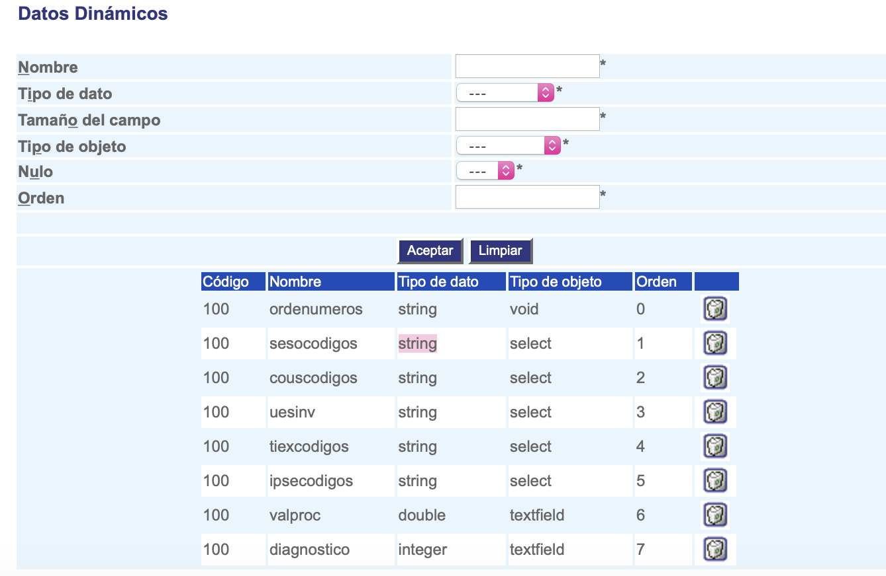

#########################
Datos Dinámicos
#########################

Esta interfaz permite la configuración de datos dinámicos. 

.. |advertencia| image:: ../../../img/alerta.png

+---------------+------------------------------------------------------------------------+
||advertencia|  | **Nota:**  Los campos acompañados por un asterisco ( * ) son de        | 
|               |                                                                        |
|               |  carácter obligatorio.                                                 |
+---------------+------------------------------------------------------------------------+

1. Ingrese a la opción **"Configuración > Configuración del sistema > Datos Dinámicos"** del árbol de 
   opciones que se encuentra a la izquierda de la pantalla.Esta acción mostrará en 
   pantalla el siguiente formulario:

+--------------------+---------------------------------------------------------------------+
|Campo 	             | Descripción                                                         |
+====================+=====================================================================+
+--------------------+---------------------------------------------------------------------+
|Nombre              | Asigne un nombre para identificar el dato dinámico.                 |
|                    |                                                                     |
+--------------------+---------------------------------------------------------------------+
|Tipo de dato        | Seleccione de la lista existente, el tipo de dato, por Ej: "FLOAT", |
|                    | "INTEGER",etc.                                                      |
+--------------------+---------------------------------------------------------------------+
|Tamaño del campo    | Escriba el valor númerico del tamaño del campo.                     |
|                    |                                                                     |
+--------------------+---------------------------------------------------------------------+
|Tipo de objeto      | Seleccione de la lista existente, el tipo de objeto, por Ej: "LABEL"|
|                    | ,"SELECT", etc.                                                     |
+--------------------+---------------------------------------------------------------------+
|Nulo                | Seleccione de la lista existente, si el dato puede ser nulo         |
|                    | seleccionando "No" o "Si".                                          |
+--------------------+---------------------------------------------------------------------+
|Orden               | Escriba el orden que va a tener el dato.                            |
|                    |                                                                     |
+--------------------+---------------------------------------------------------------------+

2. Digite o seleccione la información requerida.

3. Para terminar presione el botón "Aceptar" o pulse el botón "Limpiar" para cancelar esta acción y empezar de nuevo.
