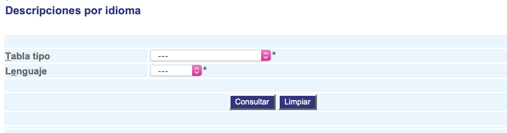

#########################
Descripciones por idioma
#########################

Esta interfaz permite crear nuevas descripciones en diferentes lenguajes para las tablas tipo del sistema.

.. |advertencia| image:: ../../../img/alerta.png

+---------------+------------------------------------------------------------------------+
||advertencia|  | **Nota:**  Los campos acompañados por un asterisco ( * ) son de        | 
|               |                                                                        |
|               |  carácter obligatorio.                                                 |
+---------------+------------------------------------------------------------------------+

1. Ingrese a la opción **"Configuración > Configuración del sistema > Descripciones por idioma"** del árbol de 
   opciones que se encuentra a la izquierda de la pantalla.Esta acción mostrará en 
   pantalla el siguiente formulario:

+--------------------+---------------------------------------------------------------------+
|Campo 	             | Descripción                                                         |
+====================+=====================================================================+
+--------------------+---------------------------------------------------------------------+
|Tabla tipo          | Seleccione de la lista existente, el tipo de tabla.                 |
|                    |                                                                     |
+--------------------+---------------------------------------------------------------------+
|Lenguaje            | Seleccione de la lista existente, el lenguaje entre "Ingles" o      |
|                    | "Español".                                                          |
+--------------------+---------------------------------------------------------------------+

2. Digite o seleccione la información requerida.

3. Para terminar presione el botón "Consultar" o pulse el botón "Limpiar" para cancelar esta acción y empezar de nuevo.
