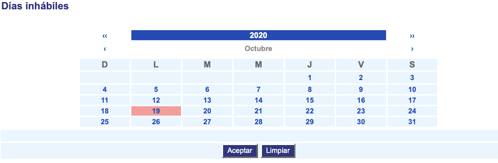

##############
Días inhábiles
##############

La funcionalidad Días inhábiles permite habilitar o deshabilitar los días en que no se 
laborará con la aplicación.

Para diligenciar esta sección, siga los pasos indicados a continuación:

1. Ingrese a la opción **"Configuración > Configuración del sistema > Días inhábiles"** del árbol de 
   opciones que se encuentra a la izquierda de la pantalla. Esta acción mostrará la 
   siguiente pantalla:

2. La pantalla muestra un calendario, el cual permite visualizar los días del mes y el año 
   en una sola pantalla. Haga clic en las flechas sencillas (|mes_atras| |mes_adelante|) para desplazarse entre los 
   meses. Haga clic en las flechas dobles (|year_back| |year_next|) para desplazarse entre los años. Haga clic en 
   el día para seleccionarlo como inhábil. Para deseleccionarlo se procede igual. 

3. Para terminar presione el botón "Aceptar" o en "Limpiar" para eliminar la selección.
