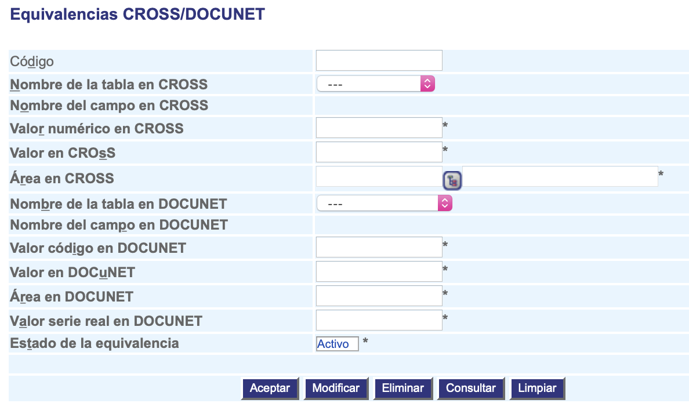

############################
Equivalencias CROSS/DOCUNET
############################

La administración de equivalencias permite crear o inactivar equivalencias entre los datos de CROSS y DOCUNET.

.. |advertencia| image:: ../../../img/alerta.png

+---------------+------------------------------------------------------------------------+
||advertencia|  | **Nota:**  Los campos acompañados por un asterisco ( * ) son de        | 
|               |                                                                        |
|               |  carácter obligatorio.                                                 |
+---------------+------------------------------------------------------------------------+

1. Ingrese a la opción **"Configuración > Configuración del sistema > Equivalencias CROSS/DOCUNET"** del árbol de 
   opciones que se encuentra a la izquierda de la pantalla.Esta acción mostrará en 
   pantalla el siguiente formulario:

+--------------------+---------------------------------------------------------------------+
|Campo               | Descripción                                                         |
+====================+=====================================================================+
|Código              | Ingrese un código para identificar la equivalencia que va a crear   |
|                    | o modificar.                                                        |
+--------------------+---------------------------------------------------------------------+
|Nombre de la tabla  | Seleccione de la lista existente, el nombre de la tabla en CROSS.   |
|en CROSS            |                                                                     |
+--------------------+---------------------------------------------------------------------+
|Nombre del campo    | Al seleccionar el campo anterior, aparecerá el nombre de campo      |
|en CROSS            | en CROSS.                                                           |
+--------------------+---------------------------------------------------------------------+
|Valor númerico en   | Ingrese el valor númerico en CROSS para hacer la equivalencia en    |
|CROSS               | DOCUNET.                                                            |
|                    |                                                                     |
+--------------------+---------------------------------------------------------------------+
|Valor en CROSS      | Ingrese el valor en CROSS para hacer la equivalencia en  DOCUNET.   |
|                    |                                                                     |
|                    |                                                                     |
+--------------------+---------------------------------------------------------------------+
|Area en CROSS       | Seleccione el area en CROSS utilizando el botón |servicio|.         |
|                    |                                                                     |
+--------------------+---------------------------------------------------------------------+
|Nombre de la tabla  | Seleccione de la lista existente, el nombre de la tabla en DOCUNET. |
|en DOCUNET          |                                                                     |
+--------------------+---------------------------------------------------------------------+
|Nombre del campo    | Al seleccionar el campo anterior, aparecerá el nombre de campo      |
|en DOCUNET          | en DOCUNET.                                                         |
+--------------------+---------------------------------------------------------------------+
|Valor código en     | Ingrese el valor de código en DOCUNET para hacer la equivalencia con|
|DOCUNET             | CROSS.                                                              |
|                    |                                                                     |
+--------------------+---------------------------------------------------------------------+
|Valor en DOCUNET    |  Ingrese el valor en DOCUNET.                                       |
|                    |                                                                     |
|                    |                                                                     |
+--------------------+---------------------------------------------------------------------+
|Area en DOCUNET     | Ingrese el valor del area de DOCUNET.                               |
|                    |                                                                     |
+--------------------+---------------------------------------------------------------------+
|Valor serie real    | Ingrese el valor serie real en DOCUNET.                             |
|en DOCUNET          |                                                                     |
+--------------------+---------------------------------------------------------------------+
|Estado de la        | Seleccione si actualmente esta equivalencias se encuentra           |
|equivalencia        | "Activa" o "Inactiva".                                              |
+--------------------+---------------------------------------------------------------------+

2. Digite o seleccione la información requerida.

3. Para terminar presione el botón "Aceptar" o pulse el botón "Limpiar" para cancelar esta 
   acción y empezar de nuevo.

4. También se permite eliminar la equivalencias siempre y cuando la equivalencia no se haya utilizado en ningún caso de CROSS hacia DOCUNET.
