############################
Administración de Parametros
############################

Estos son los parámetros del sistema, dónde se selecciona el contexto y se procede a hacer el o los cambios.

.. |advertencia| image:: ../../../img/alerta.png
.. |servicio| image:: ../../../img/servicio.png

+---------------+------------------------------------------------------------------------+
||advertencia|  | **Nota:**  Los campos acompañados por un asterisco ( * ) son de        | 
|               |                                                                        |
|               |  carácter obligatorio.                                                 |
+---------------+------------------------------------------------------------------------+

1. Ingrese a la opción **"Configuración > Configuración del sistema > Parametros"** del árbol de 
   opciones que se encuentra a la izquierda de la pantalla. Esta acción mostrará en 
   pantalla el siguiente formulario, el cuál esta divido en varios modulos:

**Modulo de horario de  atención**

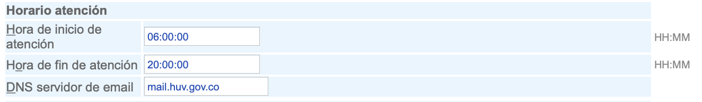

+--------------------+---------------------------------------------------------------------+
|Campo               | Descripción                                                         |
+====================+=====================================================================+
|Horario de inicio   | En el campo se visualiza el horario incial de atención.             |
|de atención         |                                                                     |
+--------------------+---------------------------------------------------------------------+
|Horario fin de      | En el campo se visualiza el horario final de atención.              |
|atención            |                                                                     |
+--------------------+---------------------------------------------------------------------+
|DNS servidor de     | En el campo se visualiza el DNS servidor de correo electronico.     |
|email               |                                                                     |
+--------------------+---------------------------------------------------------------------+

**Modulo de información de la empresa**	

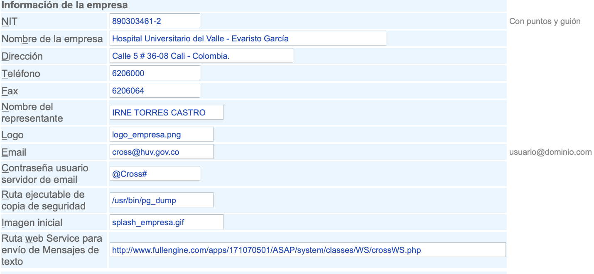

+--------------------+---------------------------------------------------------------------+
|Campo               | Descripción                                                         |
+====================+=====================================================================+
|NIT                 | En el campo se visualiza el NIT de la empresa.                      |
|                    |                                                                     |
+--------------------+---------------------------------------------------------------------+
|Nombre de la empresa| En el campo se visualiza el nombre de la empresa.                   |
|                    |                                                                     |
+--------------------+---------------------------------------------------------------------+
|Dirección           | En el campo se visualiza la dirección de la empresa.                |
|                    |                                                                     |
+--------------------+---------------------------------------------------------------------+
|Telefono            | En el campo se visualiza el telefono de la empresa.                 |
|                    |                                                                     |
+--------------------+---------------------------------------------------------------------+
|Fax                 | En el campo se visualiza el fax de la empresa.                      |
|                    |                                                                     |
+--------------------+---------------------------------------------------------------------+
|Nombre del          | En el campo se visualiza el nombre del representante legal de la    |
|representante       | empresa.                                                            |
+--------------------+---------------------------------------------------------------------+
|Logo                | En el campo se visualiza el nombre del archivo de la imagen del     |
|                    | logo.                                                               |
+--------------------+---------------------------------------------------------------------+
|E-mail              | En el campo se visualiza el correo electronico de la empresa.       |
|                    |                                                                     |
+--------------------+---------------------------------------------------------------------+
|Ruta ejecutable de  | En el campo se visualiza la ruta de copia de seguridad.             |
|copia de seguridad  |                                                                     |
+--------------------+---------------------------------------------------------------------+
|Imagen inicial      | En el campo se visualiza el nombre del archivo de la imagen inicial.|
|                    |                                                                     |
+--------------------+---------------------------------------------------------------------+
|Ruta web service    | En el campo se visualiza la ruta para envio de mensajes de texto.   |
|para envio de       |                                                                     |
|mensajes de texto   |                                                                     |
+--------------------+---------------------------------------------------------------------+

**Modulo de información de usuario web**

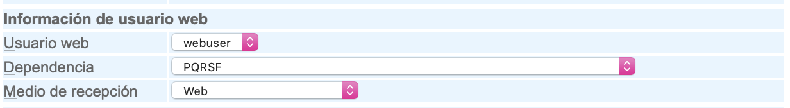

+--------------------+---------------------------------------------------------------------+
|Campo               | Descripción                                                         |
+====================+=====================================================================+
|Usuario web         | En el campo se visualiza el usuario web seleccionado de la lista    |
|                    | existente.                                                          |
+--------------------+---------------------------------------------------------------------+
|Dependencia         | En el campo se visualiza la dependencia seleccionada de la lista    |
|                    | existente.                                                          |
+--------------------+---------------------------------------------------------------------+
|Medio de recepción  | En el campo se visualiza el medio de recepción seleccionado de la   |
|                    | lista existente.                                                    |
+--------------------+---------------------------------------------------------------------+

**Modulo de dependencias para reporte detallado**

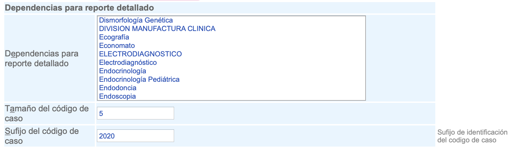

+--------------------+---------------------------------------------------------------------+
|Campo               | Descripción                                                         |
+====================+=====================================================================+
|Dependencias para   | En el campo se visualiza las dependencias seleccionadas, las cuales |
|reporte detallado   | tendrán un reporte detallado.                                       |
+--------------------+---------------------------------------------------------------------+
|Tamaño del código   | En el campo se visualiza el tamaño de caracteres del código del     |
|de caso             | caso.                                                               |
+--------------------+---------------------------------------------------------------------+
|Sufijo del código de|  En el campo se visualiza el sufjo del código del caso.             |
|caso                |                                                                     |
+--------------------+---------------------------------------------------------------------+

**Modulo de tipos de caso**

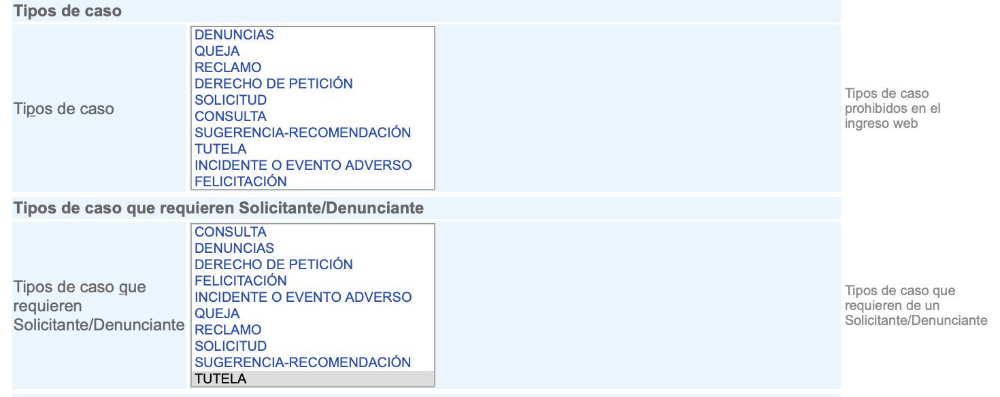

+--------------------+---------------------------------------------------------------------+
|Campo               | Descripción                                                         |
+====================+=====================================================================+
|Tipos de caso       | En el campo se visualiza el o los tipos de caso seleccionados, los  |
|                    | cuales estarán disponibles.                                         |
+--------------------+---------------------------------------------------------------------+
|Tipos de caso que   | En el campo se visualiza el o los tipos de caso que requieren       |
|requieren           |solicitante/Denunciante, los cuales estarán disponibles.             |
|solicitante/        |                                                                     |
|Denunciante         |                                                                     |
+--------------------+---------------------------------------------------------------------+

**Modulo de denuncias**

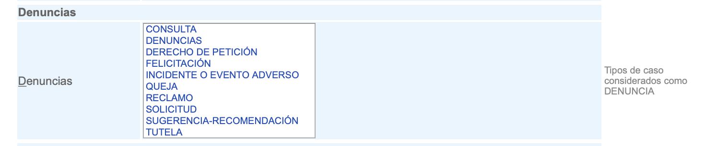

+--------------------+---------------------------------------------------------------------+
|Campo               | Descripción                                                         |
+====================+=====================================================================+
|Denuncias           | En el campo se visualiza la o las denuncias seleccionadas, las      |
|                    | cuales estarán disponibles.                                         |
+--------------------+---------------------------------------------------------------------+

**Modulo Estado de caso**

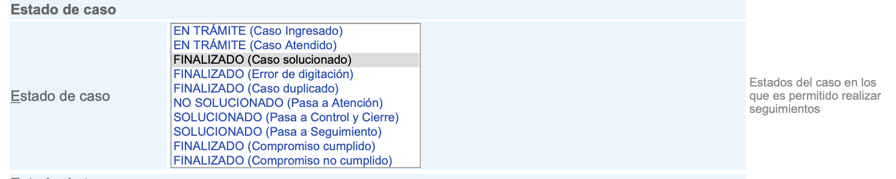

+--------------------+---------------------------------------------------------------------+
|Campo               | Descripción                                                         |
+====================+=====================================================================+
|Estado de caso      | En el campo se visualiza el o los estados de caso, los              |
|                    | cuales estarán disponibles para uso posterior.                      |
+--------------------+---------------------------------------------------------------------+

**Modulo Estado de tarea**

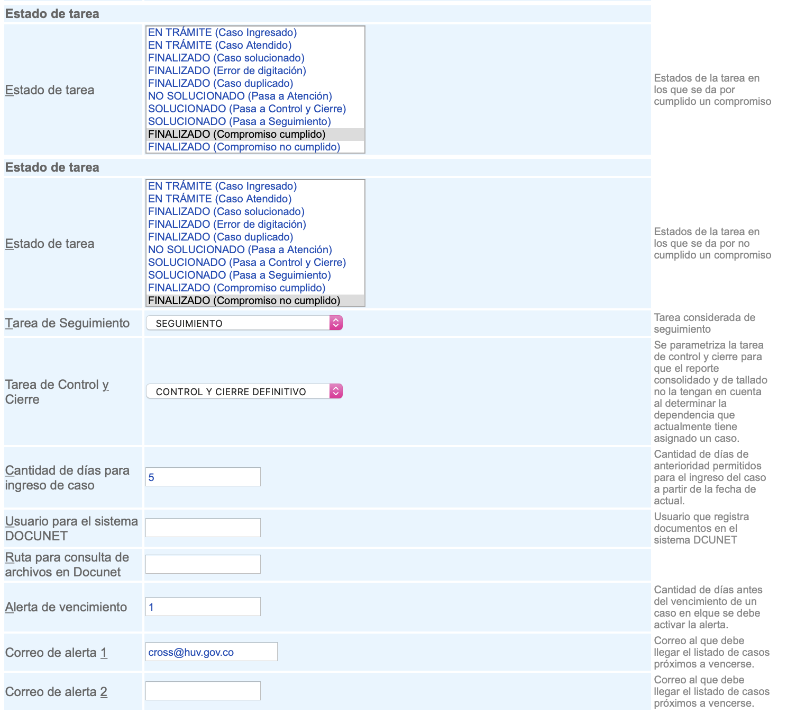

+--------------------+---------------------------------------------------------------------+
|Campo               | Descripción                                                         |
+====================+=====================================================================+
|Estado de tarea     | En el campo se visualiza el o los estados de las tareas, los        |
|                    | cuales estarán disponibles para uso posterior.                      |
+--------------------+---------------------------------------------------------------------+
|Estado de tarea     | En el campo se visualiza el o los estados de las tareas, los        |
|                    | cuales estarán disponibles para uso posterior.                      |
+--------------------+---------------------------------------------------------------------+
|Tarea de            | En el campo se visualiza la tarea considerada de seguimiento.       |
|Seguimiento         |                                                                     |
+--------------------+---------------------------------------------------------------------+
|Tarea de control y  | En el campo se visualiza la tarea de control y cierre para que el   |
|cierre              | reporte consolidado y de tallado no la tengan en cuenta al          |
|                    | determinar la dependencia que actualmente tiene asignado un caso.   |
+--------------------+---------------------------------------------------------------------+
|Cantidad de días    | En el campo se visualiza la cantidad de días de anterioridad        |
|para ingreso de     | permitidos para el ingreso del caso a partir de la fecha de actual. |
|caso                |                                                                     |
+--------------------+---------------------------------------------------------------------+
|Usuario para el     | En el campo se visualiza el usuario que registra                    |
|sistema DOCUNET     | documentos en el sistema DCUNET.                                    |
+--------------------+---------------------------------------------------------------------+
|Ruta para consulta  | En el campo se visualiza la ruta para consulta de archivo en        |
|de archivos en      | DOCUNET.                                                            |
|DOCUNET             |                                                                     |
+--------------------+---------------------------------------------------------------------+
|Alerta de           | En el campo se visualiza la cantidad de días antes del vencimiento  |
|vencimiento         | de un caso en elque se debe activar la alerta.                      |
+--------------------+---------------------------------------------------------------------+
|Correo de alerta 1  | En el campo se visualiza el correo al que debe llegar el listado de |
|                    | casos próximos a vencerse.                                          |
+--------------------+---------------------------------------------------------------------+
|Correo de alerta 2  | En el campo se visualiza el correo al que debe llegar el listado de |
|                    | casos próximos a vencerse.                                          |
+--------------------+---------------------------------------------------------------------+

**Modulo Información del cliente**

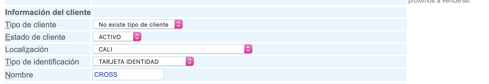

+--------------------+---------------------------------------------------------------------+
|Campo               | Descripción                                                         |
+====================+=====================================================================+
|Tipo de cliente     | En el campo se visualiza el tipo de cliente de la lista existente   |
|                    | dónde las opciones pueden ser: "oficial","industrial",etc.          |
+--------------------+---------------------------------------------------------------------+
|Estado de cliente   | En el campo se visualiza el estado del cliente, puede ser "ACTIVO", |
|                    | "INACTIVO" O "MOROSO".                                              |
+--------------------+---------------------------------------------------------------------+
|Localización        | En el campo se visualiza la localización del cliente.               |
|                    |                                                                     |
+--------------------+---------------------------------------------------------------------+
|Tipo de             | En el campo se visualiza el tipo de identificación asociada al      |
|identificación      | cliente.                                                            |
+--------------------+---------------------------------------------------------------------+
|Nombre              | En el campo se visualiza el nombre del cliente.                     |
|                    |                                                                     |
+--------------------+---------------------------------------------------------------------+

**Modulo Estados inactivos para las dependencias**

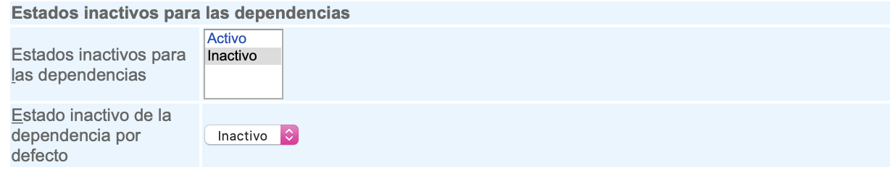

+--------------------+---------------------------------------------------------------------+
|Campo               | Descripción                                                         |
+====================+=====================================================================+
|Estados inactivos   |  En el campo se visualiza los estados para las dependencias, dónde  |
|para dependencias   |  puede seleccionarse "ACTIVO" o "INACTIVO".                         |
+--------------------+---------------------------------------------------------------------+
|Estado inactivo de  | En el campo se visualiza el estado por defecto para las dependencias|
|la dependencia por  | el cual, es "INACTIVO".                                             |
|defecto             |                                                                     |
+--------------------+---------------------------------------------------------------------+

**Modulo Estados inactivos para los grupos**

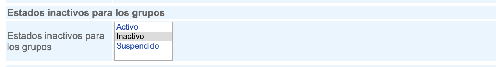

+--------------------+---------------------------------------------------------------------+
|Campo               | Descripción                                                         |
+====================+=====================================================================+
|Estados inactivos   |  En el campo se visualiza los estados para los grupos, dónde        |
|para los grupos     |  puede seleccionarse "ACTIVO" o "INACTIVO".                         |
+--------------------+---------------------------------------------------------------------+

**Modulo Dependencias**

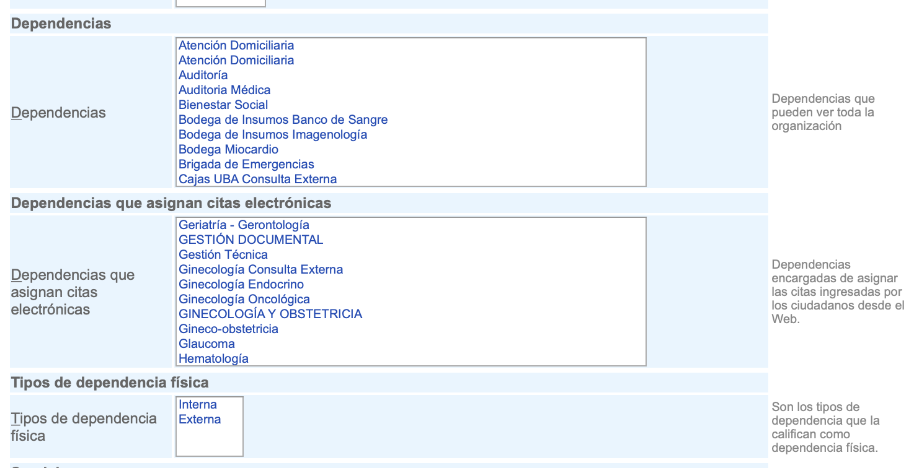

+--------------------+---------------------------------------------------------------------+
|Campo               | Descripción                                                         |
+====================+=====================================================================+
|Dependencias        |  En el campo se visualiza las dependencias que pueden ver toda      |
|                    |  la organización.                                                   |
+--------------------+---------------------------------------------------------------------+
|Dependencias que    | En el campo se visualiza las dependencias encargadas de asignar las |
|asignan citas       | citas ingresadas por los ciudadanos desde el Web.                   |
|electronicas        |                                                                     |
+--------------------+---------------------------------------------------------------------+
|Tipo de dependencia | En el campo se visualizan los tipos de dependencia que la           |
|fisica              | califican como dependencia física.                                  |
|                    |                                                                     |
+--------------------+---------------------------------------------------------------------+

**Modulo Servicios**

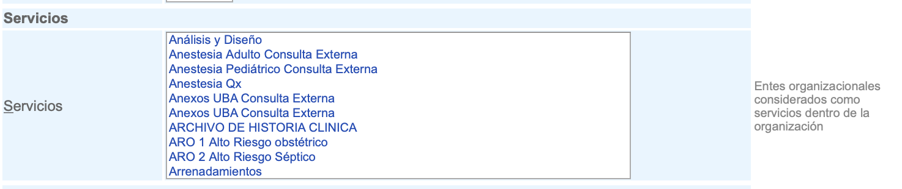

+--------------------+---------------------------------------------------------------------+
|Campo               | Descripción                                                         |
+====================+=====================================================================+
|Servicios           |  En el campo se visualiza los Entes organizacionales considerados   |
|                    |  como servicios dentro de la organización.                          |
+--------------------+---------------------------------------------------------------------+

**Modulo Estados por defecto de la tarea**

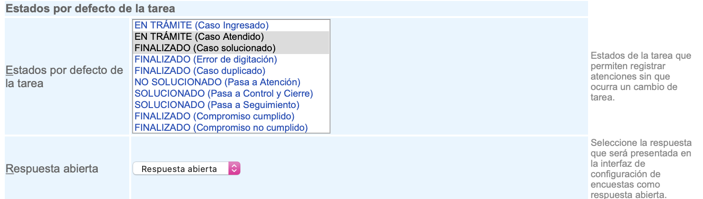

+--------------------+---------------------------------------------------------------------+
|Campo               | Descripción                                                         |
+====================+=====================================================================+
|Estados por defecto |  En el campo se visualizan los estados de la tarea que permiten     |
|de la tarea         |  registrar atenciones sin que ocurra un cambio de tarea.            |
+--------------------+---------------------------------------------------------------------+
|Respuesta abierta   | En el campo se visualiza la respuesta que será presentada en la     |
|                    | interfaz de configuración de encuestas como respuesta abierta.      |
+--------------------+---------------------------------------------------------------------+

**Modulo Objetos para pregunta**

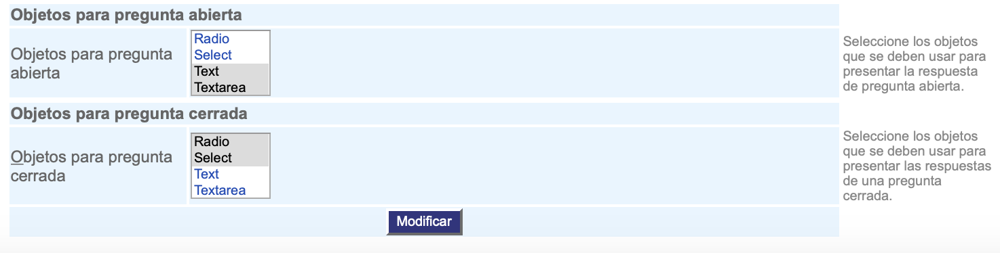
+--------------------+---------------------------------------------------------------------+
|Campo               | Descripción                                                         |
+====================+=====================================================================+
|Objetos para        |  En el campo se visualiza los objetos que se deben usar para        |
|pregunta abierta    |  presentar la respuesta de pregunta abierta.                        |
+--------------------+---------------------------------------------------------------------+
|Objetos para        | En el campo se visualiza los objetos que se deben usar para         |
|pregunta cerrada    | presentar la respuesta de pregunta cerrada.                         |
+--------------------+---------------------------------------------------------------------+

2. Digite o seleccione la información requerida.

3. Para terminar presione el botón "Modificar".

