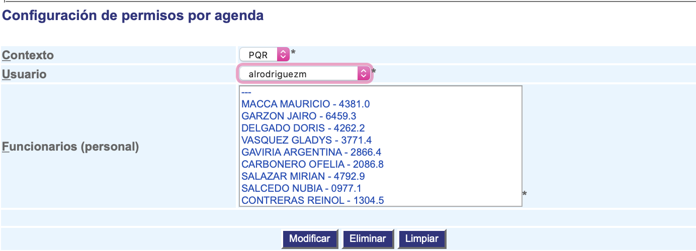

#########################
Permisos por agenda
#########################

Indica los permisos de un usuario del sistema para ver y modificar la agenda de los demás funcionarios.

.. |advertencia| image:: ../../../img/alerta.png

+---------------+------------------------------------------------------------------------+
||advertencia|  | **Nota:**  Los campos acompañados por un asterisco ( * ) son de        | 
|               |                                                                        |
|               |  carácter obligatorio.                                                 |
+---------------+------------------------------------------------------------------------+

Para configurar los permisos por dependencias, siga los pasos indicados a continuación:

1. Ingrese a la opción **"Configuración > Configuración del sistema > Permisos por agenda"** del árbol de 
   opciones que se encuentra a la izquierda de la pantalla.Esta acción mostrará en 
   pantalla el siguiente formulario:

2. Seleccione el contexto
3. Luego seleccione el usuario
4. Por ultimo, seleccione las dependencias sobre los cuales desea darle permisos al usuario
 
5. Para terminar presione el botón "Modificar" o pulse el botón "Limpiar" para cancelar esta 
   acción y empezar de nuevo.
6. También puede seleccionar un usuario y presionar "Eliminar" para borrar sus permisos.
