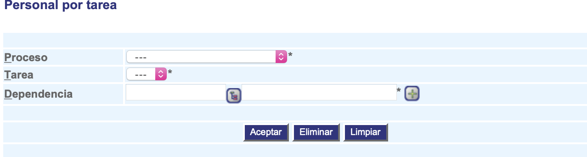

###################
Personal por tarea
###################

La interfaz de personal por tarea permite relacionar las personas que serán consideradas para ser asignadas a ejecutar una tarea en un proceso determinado. Esta configuración es usada por el componente de asignación por carga. 

.. |advertencia| image:: ../../../img/alerta.png
.. |servicio| image:: ../../../img/servicio.png

+---------------+------------------------------------------------------------------------+
||advertencia|  | **Nota:**  Los campos acompañados por un asterisco ( * ) son de        | 
|               |                                                                        |
|               |  carácter obligatorio.                                                 |
+---------------+------------------------------------------------------------------------+

1. Ingrese a la opción **"Configuración > Configuración del sistema >  Personal por tarea"** 
   del árbol de opciones que se encuentra a la izquierda de la pantalla. Esta acción 
   mostrará en pantalla el siguiente formulario:

+--------------------+---------------------------------------------------------------------+
|Campo 	             | Descripción                                                         |
+====================+=====================================================================+
| Proceso            | Seleccione de la lista existente, el proceso a relacionar.          |
|                    |                                                                     |
+--------------------+---------------------------------------------------------------------+
| Tarea              | Seleccione de la lista existente, la tarea a relacionar.            |
|                    |                                                                     |
+--------------------+---------------------------------------------------------------------+
| Dependencia        | Seleccione de la lista la dependencia encargada de diligenciar el   |
|                    | caso utilizando el botón |servicio|                                 |
+--------------------+---------------------------------------------------------------------+

2. Digite o seleccione la información requerida.

3. Para terminar presione el botón "Aceptar" o pulse el botón "Limpiar" para cancelar esta 
   acción y empezar de nuevo.