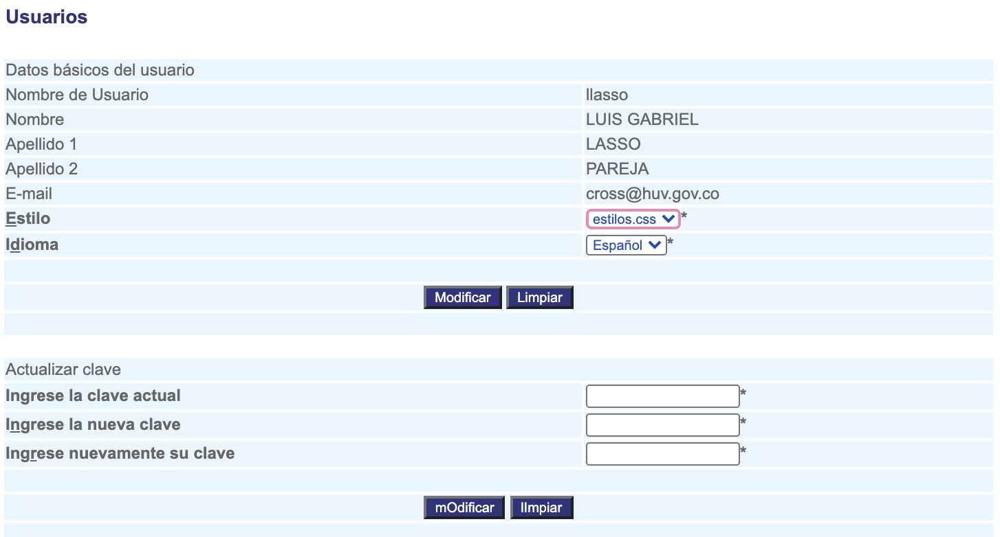

  ########
Usuarios
########

Esta funcionalidad permite Ingresar, Modificar, Consultar y Eliminar los registros usuario 
de la base de datos de la aplicación.

Para diligenciar esta sección, siga los pasos indicados a continuación:

.. |advertencia| image:: ../../../img/alerta.png

+---------------+------------------------------------------------------------------------+
||advertencia|  | **Nota:**  Los campos acompañados por un asterisco ( * ) son de        | 
|               |                                                                        |
|               |  carácter obligatorio.                                                 |
+---------------+------------------------------------------------------------------------+

1. Ingrese a la opción **"Configuración > Configuración del sistema > Usuarios"** del árbol de 
   opciones que se encuentra a la izquierda de la pantalla. Esta acción mostrará en 
   pantalla el siguiente formulario:

+--------------------+---------------------------------------------------------------------+
|Campo 	             | Descripción                                                         |
+====================+=====================================================================+
|Nombre de usuario   | Corresponde al nombre con el que se identificará al usuario que se  |
|                    | va a registrar en el sistema.                                       |
+--------------------+---------------------------------------------------------------------+
|Clave               | Hace referencia a la contraseña de seguridad que el usuario         |
|                    | utilizará para ingresar a la aplicación.                            |
+--------------------+---------------------------------------------------------------------+
|Nombres             | Hace referencia a los nombres reales del usuario que se va a        | 
|                    | registrar.                                                          |
+--------------------+---------------------------------------------------------------------+
|Apellido 1          | Hace referencia al primer apellido del usuario que se va a          |
|                    | registrar.                                                          |
+--------------------+---------------------------------------------------------------------+
|Apellido 2          | Hace referencia al Segundo apellido del usuario que se va a         |
|                    | registrar.                                                          |
+--------------------+---------------------------------------------------------------------+
|E-mail              | En este campo se ingresa la dirección de correo electrónico del     |
|                    | usuario que se va a registrar.                                      |
+--------------------+---------------------------------------------------------------------+
|Estilo              | Permite seleccionar la apariencia que tendrá la aplicación para el  |
|                    | usuario que se va a registrar.                                      |
+--------------------+---------------------------------------------------------------------+
|Idioma              | Permite seleccionar el idioma que tendrá la aplicación para el      |
|                    | usuario que se va a registrar.                                      |
+--------------------+---------------------------------------------------------------------+
|Perfil              | En este campo se selecciona el perfil que va a tener el usuario en  |
|                    | el sistema.                                                         |
+--------------------+---------------------------------------------------------------------+

2. Digite o seleccione la información requerida.

3. Para terminar presione el botón "Modificar" o pulse el botón "Limpiar" para cancelar esta 
   acción y empezar de nuevo.

4. Adicionalmente, puede actualizar su clave teniendo en cuenta los siguientes campos:

+--------------------+---------------------------------------------------------------------+
|Campo 	             | Descripción                                                         |
+====================+=====================================================================+
|Clave actual        | Hace referencia a la contraseña actual de seguridad que el usuario  |
|                    | utiliza para ingresar en el sistema.                                |
+--------------------+---------------------------------------------------------------------+
|Clave  nueva        | Hace referencia a la contraseña nueva de seguridad que el usuario   |
|                    | utilizará para ingresar a la aplicación.                            |
+--------------------+---------------------------------------------------------------------+
|Repetir clave nueva | Corresponde a la contraseña que escribio en el campo anterior con   | 
|                    | el fin de validar la contraseña.                                    |
+--------------------+---------------------------------------------------------------------+

5. Para terminar presione el botón "Modificar" o pulse el botón "Limpiar" para cancelar esta 
   acción y empezar de nuevo.