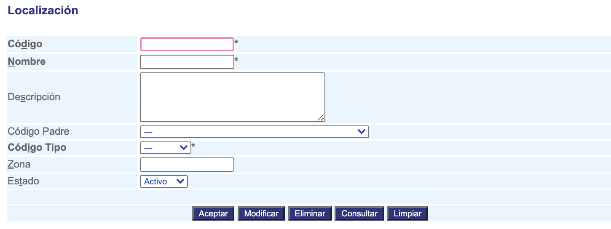

############
Localización
############

La interfaz de localización permite crear, modificar y eliminar una localización, ejemplo : Colombia, Valle del cauca, Santiago de cali

Para diligenciar esta sección, siga los pasos indicados a continuación:

.. |advertencia| image:: ../../../img/alerta.png

+---------------+------------------------------------------------------------------------+
||advertencia|  | **Nota:**  Los campos acompañados por un asterisco ( * ) son de        | 
|               |                                                                        |
|               |  carácter obligatorio.                                                 |
+---------------+------------------------------------------------------------------------+

1. Ingrese a la opción **"Configuración > Localización > Localización"** del árbol de opciones 
   que se encuentra a la izquierda de la pantalla. Esta acción mostrará en pantalla el 
   siguiente formulario:

+--------------------+---------------------------------------------------------------------+
|Campo               | Descripción                                                         |
+====================+=====================================================================+
|Código              | Ingrese un código para identificar la localización que va a crear.  |
|                    |                                                                     |
+--------------------+---------------------------------------------------------------------+
|Nombre              | Asigne un nombre para identificar la localización.                  |
|                    |                                                                     |
+--------------------+---------------------------------------------------------------------+
|Descripción         | Realice una descripción de las características del la               |
|                    | localización que va a registrar.                                    |
+--------------------+---------------------------------------------------------------------+
|Código padre        | Si la localización tiene un padre, seleccionelo de la lista,        |
|                    | por Ej: La localización "EL PLACER" tiene como padre al             |
|                    | "Corregimiento"                                                     |
+--------------------+---------------------------------------------------------------------+
|Código tipo         | Al seleccionar el código padre, saldra una la lista asociado a      |
|                    | este código. Por Ej: El código tipo "VEREDA (A)" tiene como código  |
|                    | padre a "BUENOS AIRES (A)".                                         |
+--------------------+---------------------------------------------------------------------+
|Zona                | No aplica para esta versión de CROSS.                               |
|                    |                                                                     |
+--------------------+---------------------------------------------------------------------+
|Estado              | Seleccione si actualmente esta localización se encuentra            |
|                    | "activa" o "inactiva".                                              |
+--------------------+---------------------------------------------------------------------+

2. Digite o seleccione la información requerida.

3. Para terminar presione el botón "Aceptar" o pulse el botón "Limpiar" para cancelar esta 
   acción y empezar de nuevo. 
