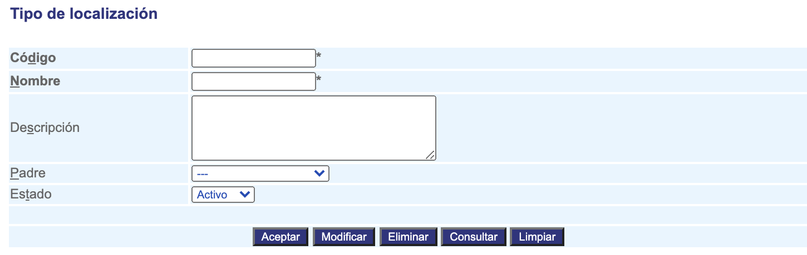

#####################
Tipos de localización
#####################

Los tipos de localización son los que identifican las diferentes localizaciones que la 
Empresa maneje, por ejemplo país, ciudad o estado.

Para diligenciar esta sección, siga los pasos indicados a continuación:

.. |advertencia| image:: ../../../img/alerta.png

+---------------+------------------------------------------------------------------------+
||advertencia|  | **Nota:**  Los campos acompañados por un asterisco ( * ) son de        | 
|               |                                                                        |
|               |  carácter obligatorio.                                                 |
+---------------+------------------------------------------------------------------------+

1. Ingrese a la opción **"Configuración > Localización > Tipos de localización"** del árbol de 
   opciones que se encuentra a la izquierda de la pantalla. Esta acción mostrará en 
   pantalla el siguiente formulario:

+--------------------+---------------------------------------------------------------------+
|Campo 	             | Descripción                                                         |
+====================+=====================================================================+
|Código              | Ingrese un código para identificar el tipo de localización que va   |
|                    | a crear.                                                            |
+--------------------+---------------------------------------------------------------------+
|Nombre              | Asigne un nombre para identificar el tipo de localización.          |
|                    |                                                                     |
+--------------------+---------------------------------------------------------------------+
|Descripción         | Realice una descripción de las características del tipo de          |
|                    | localización que va a registrar.                                    |
+--------------------+---------------------------------------------------------------------+
|Padre               | Si el tipo de localización tiene un padre, seleccionelo de la lista,|
|                    | por Ej: El tipo de localización "Municipio" tiene como padre al     |
|                    | "Departamento"                                                      |
+--------------------+---------------------------------------------------------------------+
|Estado              | Seleccione si actualmente este tipo de localización se encuentra    |
|                    | "activa" o "inactiva".                                              |
+--------------------+---------------------------------------------------------------------+

2. Digite o seleccione la información requerida.

3. Para terminar presione el botón "Aceptar" o pulse el botón "Limpiar" para cancelar esta 
   acción y empezar de nuevo.
