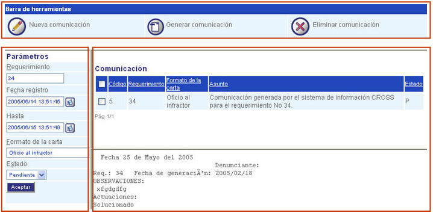

########################
Centro de comunicaciones
########################

Su función principal es administrar las comunicaciones generadas por la atención de los requerimientos, está en capacidad de consultar, generar, eliminar y crear comunicaciones.

.. toctree::
   :maxdepth: 2

   nueva_comunicacion
   generar_comunicacion
   eliminar_seleccion

La pantalla de esta funcionalidad esta compuesta por los siguientes elementos:

=====================
Barra de herramientas
=====================

.. |nuevo_mail| image:: ../../../../img/nuevo_mail.jpg

+-----------------+---------------------------------------------------------------------+
|                 | Este botón le permitirá crear una nueva comunicación para atender   |
| |nuevo_mail|    |                                                                     |
|                 | un requerimiento.                                                   |
+-----------------+---------------------------------------------------------------------+
|                 | Para generar comunicaciones de forma automática, haga clic en este  |
| |comunic_boton| |                                                                     |
|                 | botón.                                                              |
+-----------------+---------------------------------------------------------------------+
|                 | Para eliminar un registro de comunicación, utilice este botón.      |
| |eliminar_mail| |                                                                     |
|                 |                                                                     |
+-----------------+---------------------------------------------------------------------+

==========
Parametros
==========
La zona de "Parámetros" presenta un formulario que le permite crear filtros para la 
búsqueda de registros de comunicaciones.

+--------------------+---------------------------------------------------------------------+
|Campo 	             | Descripción                                                         |
+====================+=====================================================================+
|Requerimiento       | Indique el código del requerimiento.                                |
+--------------------+---------------------------------------------------------------------+
|Ente organizacional | Seleccione ente organizacional.                                     |
+--------------------+---------------------------------------------------------------------+
|Fecha de registro   | Este campo le permite realizar búsqueda por la fecha de registro del| 
|                    | requerimiento - "Desde".                                            |
+--------------------+---------------------------------------------------------------------+
|Hasta               | Este campo le permite realizar búsqueda por la fecha de registro del|
|                    | requerimiento - "Hasta".                                            |
+--------------------+---------------------------------------------------------------------+
|Formato de la carta | Seleccione de la lista el formato de la carta (plantilla) que desea |
|                    | utilizar para la nueva comunicación.                                |
+--------------------+---------------------------------------------------------------------+
|Estado              | Seleccione de la lista si el registro de comunicación se encuentra  |
|                    | "Generada" o "Pendiente".                                           |
+--------------------+---------------------------------------------------------------------+

Para ver los resultados de los parámetros introducidos en el formulario, haga clic en el 
botón "Aceptar". 

====================
Zona de comunicacion
====================

La zona de "Comunicación" muestra los registros de comunicación que se presentarón luego de 
realizar búsqueda a través del formulario de "Parámetros". 

