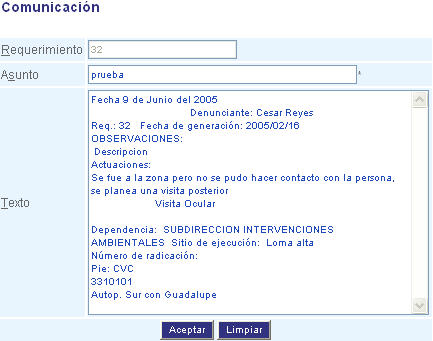

##################
Nueva comunicación
##################

Esta interfaz le permite enviar un comunicado para dar respuesta a un requerimiento

Para diligenciar esta sección, siga los pasos indicados a continuación:

.. |advertencia| image:: ../../../../img/alerta.png

+---------------+------------------------------------------------------------------------+
||advertencia|  | **Nota:**  Los campos acompañados por un asterisco ( * ) son de        | 
|               |                                                                        |
|               |  carácter obligatorio.                                                 |
+---------------+------------------------------------------------------------------------+

.. |nuevo| image:: ../../../../img/nuevo_mail.jpg

1. Haga clic en el |nuevo| botón que se encuentra en la parte superior del "Centro de 
   comunicaciones". Esta acción mostrará una nueva ventana con la siguiente pantalla.

.. |info| image:: ../../../../img/informacion.png

+---------------+------------------------------------------------------------------------+
||info|         | Para poder ingresar al formato de la "Nueva comunicación" debe llenar  | 
|               | antes y de manera obligatoria los campos "Requerimiento" y "Formato de |
|               | la carta" que se encuentran en la zona de "Parámetros" del "Centro de  |
|               | comunicaciones".                                                       |
+---------------+------------------------------------------------------------------------+

+--------------------+---------------------------------------------------------------------+
|Campo 	             | Descripción                                                         |
+====================+=====================================================================+
|Requerimiento       | En este campo aparece el número del requerimiento que se indicó en  |
|                    | la zona de "Parámetros".                                            |
+--------------------+---------------------------------------------------------------------+
|Asunto              | Hace referencia al tema que se está tratando.                       |
|                    |                                                                     |
+--------------------+---------------------------------------------------------------------+
|Texto               | En este campo se consigna la información que llevará el comunicado  |
|                    | haciendo uso de la plantilla que se configuró previamente en la     |
|                    | funcionalidad "Formatos de carta".                                  |
+--------------------+---------------------------------------------------------------------+

2. Digite o seleccione la información requerida.

3. Para terminar presione el botón "Aceptar" o pulse el botón "Limpiar" para cancelar esta 
   acción y empezar de nuevo. 
