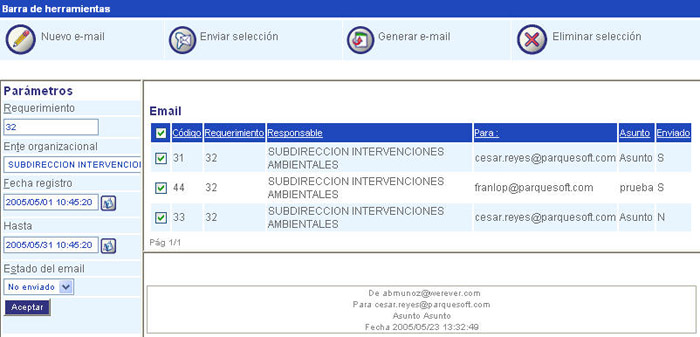

#########################
Enviar selección de email
#########################

Esta interfaz le permite enviar e-mail para informar los avances de un requerimiento.

Para diligenciar esta sección, siga los pasos indicados a continuación:

.. |advertencia| image:: ../../../../img/alerta.png

+---------------+------------------------------------------------------------------------+
||advertencia|  | **Nota:**  Los campos acompañados por un asterisco ( * ) son de        | 
|               |                                                                        |
|               |  carácter obligatorio.                                                 |
+---------------+------------------------------------------------------------------------+

1. Ingrese a la opción "General > Utilidades > Centro de E-mail" del árbol de opciones que 
   se encuentra a la izquierda de la pantalla. Indique los parámetros de búsqueda en la 
   zona de Parámetros, haga clic en "Aceptar". Esta acción mostrará la siguiente pantalla:

.. |mail_selec_1| image:: ../../../../img/mail_selec_1.jpg
.. |mail_selec_2| image:: ../../../../img/mail_selec_2.jpg

2. Haga clic en la casilla vacía |mail_selec_1| para seleccionar los e-mail que desea 
   enviar, esta acción mostrará la casilla en estado seleccionado |mail_selec_2|.

.. |email_boton_enviar_selec| image:: ../../../../img/email_boton_enviar_selec.jpg

3. Para terminar la acción presione el botón "Enviar selección" |email_boton_enviar_selec|.
