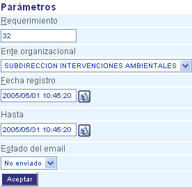

################
Centro de E-mail
################

.. toctree::
   :maxdepth: 2

   nuevo_email
   enviar_seleccion
   generar_email
   eliminar_seleccion

Su función principal es administrar los e-mail generados por la atención de los 
requerimientos, esta en capacidad de consultar, generar, eliminar, enviar y crear e-mail.

La pantalla de esta funcionalidad esta compuesta por los siguientes elementos:

=====================
Barra de herramientas
=====================
La zona de "Barra de herramientas" presenta cuatro botones de funciones básicas como son:
"Nuevo correo", "Enviar selección", "Generar e-mail" y "Eliminar selección". 

.. |nuevo_mail| image:: ../../../../img/nuevo_mail.jpg

.. |eliminar_mail| image:: ../../../../img/eliminar_mail.jpg

+-----------------+---------------------------------------------------------------------+
|                 | Este botón le permitirá crear un nuevo correo para atender un       |
| |nuevo_mail|    |                                                                     |
|                 | requerimiento.                                                      |
+-----------------+---------------------------------------------------------------------+
|                 | Con este botón puede enviar simultáneamente una selección o grupo   |
| |enviar_selec|  |                                                                     |
|                 | de correos, para atender un requerimiento                           |
+-----------------+---------------------------------------------------------------------+
|                 | Para revisar cuales correos ha generado el sistema de forma         |
| |generar_mail|  |                                                                     |
|                 | automática, haga clic en este botón.                                |
+-----------------+---------------------------------------------------------------------+
|                 | Para eliminar una selección de correos, utilice este botón.         |
| |eliminar_mail| |                                                                     |
|                 |                                                                     |
+-----------------+---------------------------------------------------------------------+

==========
Parametros
==========

La zona de "Parámetros" presenta un formulario que le permite crear filtros para la 
búsqueda de registros de correos. 

+--------------------+---------------------------------------------------------------------+
|Campo 	             | Descripción                                                         |
+====================+=====================================================================+
|Requerimiento       | Indique el código del requerimiento.                                |
+--------------------+---------------------------------------------------------------------+
|Ente organizacional | Seleccione ente organizacional.                                     |
+--------------------+---------------------------------------------------------------------+
|Fecha de registro   | Este campo le permite realizar búsqueda por la fecha de registro del| 
|                    | requerimiento - "Desde".                                            |
+--------------------+---------------------------------------------------------------------+
|Hasta               | Este campo le permite realizar búsqueda por la fecha de registro del|
|                    | requerimiento - "Hasta".                                            |
+--------------------+---------------------------------------------------------------------+
|Estado del e-mail   |  Seleccione de la lista si el registro de correo que va a buscar fue|
|                    |  "Enviado" o "No enviado".                                          |
+--------------------+---------------------------------------------------------------------+

Para ver los resultados de los parámetros introducidos en el formulario, haga clic en el 
botón "Aceptar". 

=============
Zona de email
=============

La zona de "E-mail" muestra  los registros de correos que se presentarón luego de realizar 
la búsqueda a través del formulario de "Parámetros". Esta zona permite ejecutar las 
opciones de "Envio de selección" de "Generar e-mail" y de "Eliminar selección". Ver figura. 

