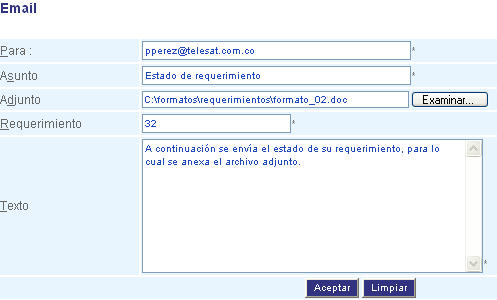

############
Nuevo E-mail
############
Esta interfaz le permite enviar e-mail para informar los avances de un requerimiento.

.. |advertencia| image:: ../../../../img/alerta.png

+---------------+------------------------------------------------------------------------+
||advertencia|  | **Nota:**  Los campos acompañados por un asterisco ( * ) son de        | 
|               |                                                                        |
|               |  carácter obligatorio.                                                 |
+---------------+------------------------------------------------------------------------+

Para diligenciar esta sección, siga los pasos indicados a continuación:

.. |nuevo_mail| image:: ../../../../img/nuevo_mail.jpg

1. Haga clic en el botón |nuevo_mail| que se encuentra en la parte superior del "Centro de 
   E-mail". Esta acción mostrará una nueva ventana con la siguiente pantalla.

+--------------------+---------------------------------------------------------------------+
|Campo 	             | Descripción                                                         |
+====================+=====================================================================+
|Para                | Indique la dirección de correo electrónico del destinatario.        |
|                    |                                                                     |
+--------------------+---------------------------------------------------------------------+
|Asunto              | Hace referencia al tema que se está tratando.                       |
|                    |                                                                     |
+--------------------+---------------------------------------------------------------------+
|Adjunto             | Si va anexar un archivo haga clic en el botón "examinar" y          |
|                    | busque el documento que desea adjuntar.                             |
+--------------------+---------------------------------------------------------------------+
|Requerimiento       | Indique el código del requerimiento.                                |
|                    |                                                                     |
+--------------------+---------------------------------------------------------------------+
|Texto               | Agregue el texto que va a llevar el mensaje.                        |
|                    |                                                                     |
+--------------------+---------------------------------------------------------------------+

2. Digite o seleccione la información requerida.

3. Para terminar presione el botón "Aceptar" o pulse el botón "Limpiar" para cancelar esta 
   acción y empezar de nuevo. 

================
Adjuntar Archivo
================

Para adjuntar un archivo, siga los pasos indicados a continuación:

.. |info| image:: ../../../../img/informacion.png

+---------------+------------------------------------------------------------------------+
||info|         | **Nota:**  Los campos acompañados por un asterisco ( * ) son de        | 
|               |                                                                        |
|               |  carácter obligatorio.                                                 |
+---------------+------------------------------------------------------------------------+

1. Haga clic en el botón "Examinar" que se encuentra al lado del campo "Adjunto". Esta 
   acción le desplegará el árbol de directorios de su máquina local y le mostrará una 
   pantalla como esta:  

   .. image:: ../../../../img/email_examinar.jpg
    :alt: Formulario nuevo email 

2. Para buscar el archivo que desea adjuntar haga clic en las opciones de "Buscar en" 
   utilizando los íconos del lado izquierdo de esta pantalla o haciendo clic en la 
   pestaña que se encuentra en la parte superior de la misma. Esta acción va a desplegar el 
   siguiente árbol de exploración:

   .. image:: ../../../../img/email_examinar_pestana_desplaz.jpg
    :alt: Examinar archivo 1

3. Seleccione la unidad o el directorio donde se encuentra el archivo que desea adjuntar. 
   Por Ej: en este caso, se busca el archivo que se encuentra en la ruta: 
   "C:\formatos\requerimientos\formato_02.doc", para lo cual debemos selecciónar de primero 
   el disco local "C". Esta acción mostrará la siguiente pantalla:

   .. image:: ../../../../img/email_examinar_pestana_desplaz2.jpg
    :alt: Examinar archivo 2

4. Siguiendo con el ejemplo, ingrese al directorio "formatos" haciendo doble clic sobre él 
   o seleccionándolo (con un clic) y presionando el botón "Abrir". Esta acción lo llevará a 
   la siguiente pantalla:

   .. image:: ../../../../img/email_examinar_pestana_desplaz3.jpg
    :alt: Examinar archivo 3

5. Ingrese al directorio "requerimientos" (continuando con el ejemplo) y seleccione el 
   archivo "formato_02", haciendo doble clic sobre él o seleccionándolo y haciendo clic en 
   el botón "Abrir". Ver figura. 

   .. image:: ../../../../img/email_examinar_pestana_desplaz4.jpg
    :alt: Examinar archivo 4

6. Esta acción lo llevará nuevamente a la opción de correo nuevo de CROSS 3.0, y le 
   mostrará en el campo "adjunto" la ruta del archivo que va a enviar anexo. Ver figura.

   .. image:: ../../../../img/email_examinar_adjunto.jpg
    :alt: Examinar adjunto

7. Para terminar presione el botón "Aceptar" o pulse el botón "Limpiar" para cancelar esta 
   acción y empezar de nuevo.
