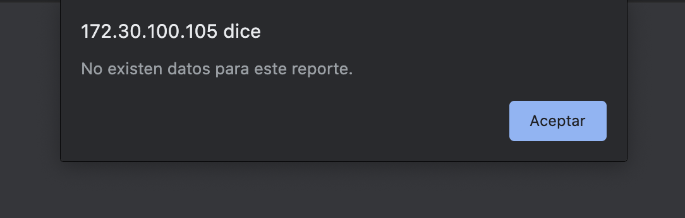
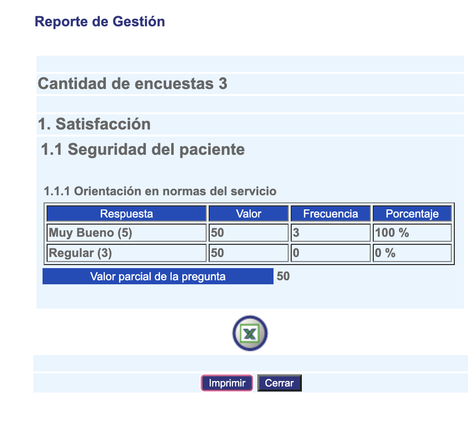

###############################
Reporte resultado de encuestas
###############################

El indicador de encuestas por servicio presenta el análisis de resultados de las encuestas para cada servicio.

.. |info| image:: ../../../img/informacion.png
.. |advertencia| image:: ../../../img/alerta.png
.. |fecha| image:: ../../../img/fecha.png

+---------------+------------------------------------------------------------------------+
||advertencia|  | **Nota:**  Los campos acompañados por un asterisco ( * ) son de        |
|               | carácter obligatorio.                                                  |
|               |                                                                        |
+---------------+------------------------------------------------------------------------+
Para diligenciar esta sección, siga los pasos indicados a continuación:

1. Ingrese a la opción **"Medición > Reportes y listados > Reporte resultado de encuestas"** del árbol de
   opciones que se encuentra a la izquierda de la pantalla. Esta acción mostrará la
   siguiente pantalla:

      .. image:: ../../../img/reporte_resultados.png
         :alt: Tema

+------------------------+------------+----------+-------------------+
| Campo                  |    Descripción                            |
|                        |                                           |
+========================+============+==========+===================+
| Fecha de registro      | Al presionar el primer boton |fecha| puede|
|                        | seleccionar el día desde que desea        |
|                        | consultar y seleccionando el segundo boton|
|                        | |fecha| hasta que fecha va a consultar.   |
+------------------------+------------+----------+-------------------+
| Formulario             | Seleccione uno de los formularios         |
|                        | existentes de la lista que desea          |
|                        | consultar.                                |
+------------------------+------------+----------+-------------------+

2. Digite o seleccione la información requerida.

3. Para terminar presione el botón "Consultar" o pulse el botón "Limpiar" para cancelar esta acción y empezar de nuevo.

4. Al presionar el botón "Consultar" pueden salir dos opciones, la primera puede ser la siguiente pantalla:

O si se encuentran datos, aparecera la siguiente pantalla:

donde aparecera la información consultada y se podra exportar como archivo xslx.
