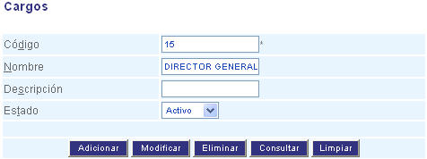

#################
Configurar Cargos
#################

Esta funcionalidad permite crear cargos dentro de la estructura organizacional en la aplicación. 

.. |advertencia| image:: ../../../img/alerta.png

+---------------+------------------------------------------------------------------------+
||advertencia|  | **Nota:**  Los campos acompañados por un asterisco ( * ) son de        | 
|               |                                                                        |
|               |  carácter obligatorio.                                                 |
+---------------+------------------------------------------------------------------------+
Para diligenciar esta sección, siga los pasos indicados a continuación:

1. Ingrese a la opción **"Recursos humanos > Configuración de RRHH > Cargos"** 
   del árbol de opciones que se encuentra a la izquierda de la pantalla. Esta acción 
   mostrará en pantalla el siguiente formulario:

+--------------------+---------------------------------------------------------------------+
|Campo 	             | Descripción                                                         |
+====================+=====================================================================+
|Código              | Ingrese un código para identificar el cargo  que                    |
|                    | va a crear.                                                         |
+--------------------+---------------------------------------------------------------------+
|Nombre              | Asigne un nombre para identificar el cargo .                        |
|                    |                                                                     |
+--------------------+---------------------------------------------------------------------+
|Descripción         | Realice una descripción de las características del cargo            |
|                    |                                                                     |
+--------------------+---------------------------------------------------------------------+
|Estado              | Seleccione de la lista, si el tipo sera "Activo" o "Inactivo".      |
|                    |                                                                     |
+--------------------+---------------------------------------------------------------------+

2. Digite o seleccione la información requerida.

3. Para terminar presione el botón "Aceptar" o pulse el botón "Limpiar" para cancelar esta 
   acción y empezar de nuevo.   