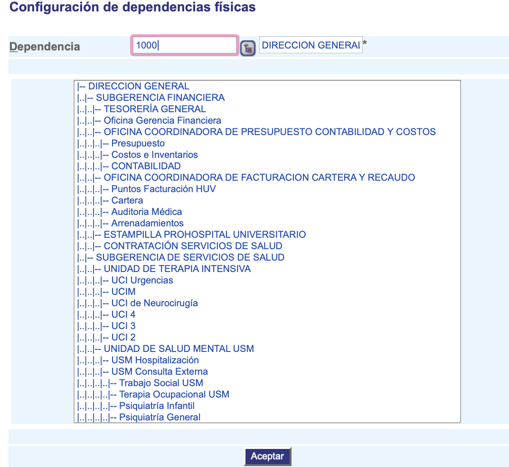

######################################
Configuración de dependencias físicas
######################################

 Indica que dependencias conforman una dependencia física.

.. |advertencia| image:: ../../../img/alerta.png
.. |servicio| image:: ../../../img/servicio.png

+---------------+------------------------------------------------------------------------+
||advertencia|  | **Nota:**  Los campos acompañados por un asterisco ( * ) son de        | 
|               |                                                                        |
|               |  carácter obligatorio.                                                 |
+---------------+------------------------------------------------------------------------+

1. Ingrese a la opción **"Recursos humanos > Configuración de RRHH > Configuración de dependencias físicas"** 
   del árbol de opciones que se encuentra a la izquierda de la pantalla. Esta acción 
   mostrará en pantalla el siguiente formulario:

+--------------------+---------------------------------------------------------------------+
|Campo 	             | Descripción                                                         |
+====================+=====================================================================+
| Dependencia        | Seleccione de la lista la dependencia encargada de diligenciar el   |
|                    | caso utilizando el botón |servicio|                                 |
+--------------------+---------------------------------------------------------------------+

2. Digite o seleccione la información requerida.

3. El siguiente campo, muestra como es la jerarquia de las dependencias y en que nivel se encuentra cada una, por medio de (|..) anidados.

3. Para terminar presione el botón "Aceptar".