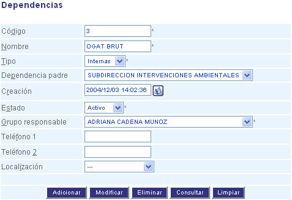

############
Dependencias
############

 Las dependencias son los componentes de la estructura de la organización.

.. |advertencia| image:: ../../../img/alerta.png

+---------------+------------------------------------------------------------------------+
||advertencia|  | **Nota:**  Los campos acompañados por un asterisco ( * ) son de        | 
|               |                                                                        |
|               |  carácter obligatorio.                                                 |
+---------------+------------------------------------------------------------------------+
Para diligenciar esta sección, siga los pasos indicados a continuación:

1. Ingrese a la opción **"Recursos humanos > Registro > Dependencias"**
   del árbol de opciones que se encuentra a la izquierda de la pantalla. Esta acción 
   mostrará en pantalla el siguiente formulario:

+--------------------+---------------------------------------------------------------------+
|Campo 	             | Descripción                                                         |
+====================+=====================================================================+
|Código              | Ingrese un código para identificar la dependencia que va a crear.   |
|                    |                                                                     |
+--------------------+---------------------------------------------------------------------+
|Nombre              | Asigne un nombre para identificar la dependencia.                   |
|                    |                                                                     |
+--------------------+---------------------------------------------------------------------+
|Tipo                | Realice una descripción de las características del cargo.           |
|                    |                                                                     |
+--------------------+---------------------------------------------------------------------+
|Dependencia padre   | Seleccione la dependencia padre a la que pertenece.                 |
|                    |                                                                     |
+--------------------+---------------------------------------------------------------------+
|Creación            | Indique la fecha de creación del grupo.                             |
|                    |                                                                     |
+--------------------+---------------------------------------------------------------------+
|Estado              | Indique si el grupo se va encontrar en estado "Activo" o "Inactivo".|
|                    |                                                                     |
+--------------------+---------------------------------------------------------------------+
|Grupo responsable   | Seleccione de la lista el grupo responsable.                        |
|                    |                                                                     |
+--------------------+---------------------------------------------------------------------+
|Teléfono 1          | Indique el número de teléfono del responsable.                      |
|                    |                                                                     |
+--------------------+---------------------------------------------------------------------+
|Teléfono 2          | Indique un segundo número de teléfono del responsable.              |
|                    |                                                                     |
+--------------------+---------------------------------------------------------------------+
|Localización        | Seleccione la localización del grupo.                               |
|                    |                                                                     |
+--------------------+---------------------------------------------------------------------+

2. Digite o seleccione la información requerida.

3. Para terminar presione el botón "Aceptar" o pulse el botón "Limpiar" para cancelar esta 
   acción y empezar de nuevo.   