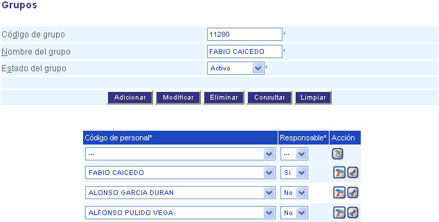

######
Grupos
######

Esta funcionalidad permite la creación de grupos que hacen parte de la estructura 
organizacional en la aplicación. Igualmente permite la asignación del personal que lo 
compone y su responsabilidad dentro del mismo.

.. |advertencia| image:: ../../../img/alerta.png

+---------------+------------------------------------------------------------------------+
||advertencia|  | **Nota:**  Los campos acompañados por un asterisco ( * ) son de        | 
|               |                                                                        |
|               |  carácter obligatorio.                                                 |
+---------------+------------------------------------------------------------------------+
Para diligenciar esta sección, siga los pasos indicados a continuación:

1. Ingrese a la opción **"Recursos humanos > Registro > Grupos"** del árbol de opciones que 
   se encuentra a la izquierda de la pantalla. Esta acción mostrará en pantalla el 
   siguiente formulario:

.. |modificar| image:: ../../../img/reg_modificar_boton.jpg

+--------------------+---------------------------------------------------------------------+
|Campo 	             | Descripción                                                         |
+====================+=====================================================================+
|Código de grupo     | Ingrese un código para identificar el grupo que va a crear.         |
|                    |                                                                     |
+--------------------+---------------------------------------------------------------------+
|Nombre de grupo     | Asigne un nombre para identificar el grupo.                         |
|                    |                                                                     |
+--------------------+---------------------------------------------------------------------+
|Estado del grupo    | Seleccione de la lista si el grupo va estar "Activo" o "Inactivo".  |
|                    |                                                                     |
+--------------------+---------------------------------------------------------------------+
|Responsable         | Este campo le permite seleccionar de la lista si el personal        |
|                    | ingresado tiene responsabilidad o no sobre un requerimiento.        |
+--------------------+---------------------------------------------------------------------+
|Acción              |Este campo está compuesto por las herramientas que permiten          |                                                                     |
|                    |administrar el personal que conforma el grupo. Asi, para agregar un  |  
|                    |nuevo personal y su responsabilidad debe hacer clic sobre el botón   |
|                    ||adicionar|. Para modificar un registro de personal ya ingresado se  |
|                    |hace clic en el botón |modificar|, después de haber realizado los    |
|                    |cambios. Para eliminar un registro presione el botón |borrar|.       |
+--------------------+---------------------------------------------------------------------+

.. |info| image:: ../../../img/informacion.png

+---------------+------------------------------------------------------------------------+
||info|         | **Nota:** No se puede asignar más de una persona como responsable del  | 
|               | requerimiento dentro de un mismo grupo.                                |
+---------------+------------------------------------------------------------------------+

2. Digite o seleccione la información requerida.

3. Para terminar presione el botón "Aceptar" o pulse el botón "Limpiar" para cancelar esta 
   acción y empezar de nuevo.   