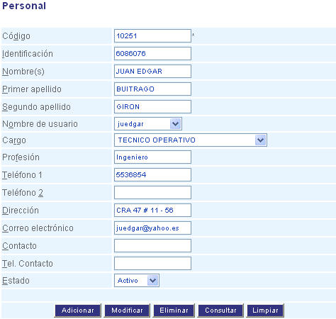

########
Personal
########

Esta funcionalidad permite ingresar los datos del personal que hace parte de la estructura 
organizacional en la aplicación.

.. |advertencia| image:: ../../../img/alerta.png

+---------------+------------------------------------------------------------------------+
||advertencia|  | **Nota:**  Los campos acompañados por un asterisco ( * ) son de        | 
|               |                                                                        |
|               |  carácter obligatorio.                                                 |
+---------------+------------------------------------------------------------------------+
Para diligenciar esta sección, siga los pasos indicados a continuación:

1. Ingrese a la opción **"Recursos humanos > Registro > Personal"** del árbol de opciones que 
   se encuentra a la izquierda de la pantalla. Esta acción mostrará en pantalla el 
   siguiente formulario:

+--------------------+---------------------------------------------------------------------+
|Campo 	             | Descripción                                                         |
+====================+=====================================================================+
|Código              | Ingrese un código para identificar al peronal que va a crear.       |
|                    |                                                                     |
+--------------------+---------------------------------------------------------------------+
|Identificación      | Ingrese el número de identificación del personal.                   |
|                    |                                                                     |
+--------------------+---------------------------------------------------------------------+
|Nombre(s)           | Asigne un nombre para identificarel personal.                       |
|                    |                                                                     |
+--------------------+---------------------------------------------------------------------+
|Primer apellido     | En este campo ingrese el primer apellido.                           |
|                    |                                                                     |
+--------------------+---------------------------------------------------------------------+
|Segundo apellido    | En este campo ingrese el segundo apellido.                          |
|                    |                                                                     |
+--------------------+---------------------------------------------------------------------+
|Nombre de usuario   |Seleccione de la lista el nombre de usuario que le va a asignar a    |
|                    |este personal.                                                       |
+--------------------+---------------------------------------------------------------------+
|Cargo               | Seleccione de la lista el cargo que corresponda.                    |
|                    |                                                                     |
+--------------------+---------------------------------------------------------------------+
|Profesión           | Indique la profesión del personal que está registrando.             |
|                    |                                                                     |
+--------------------+---------------------------------------------------------------------+
|Teléfono 1          | Registre el número de teléfono.                                     |
|                    |                                                                     |
+--------------------+---------------------------------------------------------------------+
|Teléfono 2          | Registre el número de teléfono alternativo.                         |
|                    |                                                                     |
+--------------------+---------------------------------------------------------------------+
|Dirección           |Escriba en este campo la dirección del personal que está registrando.|
|                    |                                                                     |
+--------------------+---------------------------------------------------------------------+
|Correo electrónico  | Registre la dirección de correo electrónico.                        |
|                    |                                                                     |
+--------------------+---------------------------------------------------------------------+
|Contacto            | Ingrese el nombre del contacto.                                     |
|                    |                                                                     |
+--------------------+---------------------------------------------------------------------+
|Tel. Contacto       | Escriba el teléfono del contacto.                                   |
|                    |                                                                     |
+--------------------+---------------------------------------------------------------------+
|Estado              | Seleccione si el personal que está creando va estar                 |
|                    | "Activo" o "Inactivo".                                              |
+--------------------+---------------------------------------------------------------------+

2. Digite o seleccione la información requerida.

3. Para terminar presione el botón "Aceptar" o pulse el botón "Limpiar" para cancelar esta 
   acción y empezar de nuevo.   