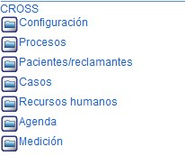
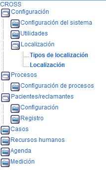

##############
Menú Principal
##############

.. |carpeta| image:: ../img/carpeta.jpg 
    :alt: Icono carpeta

Esta aplicación posee un menú de opciones que se encuentra localizado en la parte izquierda 
de la pantalla. Las opciones disponibles le permiten ingresar a cada uno de los módulos 
para su respectivo diligenciamiento, consulta o modificación de los datos registrados. 

Para utlizar el menú de opciones del sistema, siga los pasos indicados a continuación:

1. El menú de opciones se encuentra diseñado en forma de árbol, el cual se encuentra 
   constituido por siete (7) aplicativos principales que son: "General", "Procesos", "Clientes",
   "Requerimientos", "Recursos humanos", "Agenda" y "Medicion".

..
    Todo
    Crear toctree de la descripción operativa del sistema aqui

2. Cada aplicativo está constituido por subcarpetas los cuales se despliegan 
   haciendo clic en el ícono |carpeta| que acompaña a cada uno de ellos. A la vez, cada carpeta 
   contiene las diferentes funcionalidades de la aplicación. Por Ejemplo: la carpeta  
   "Localización" que pertenece al aplicativo "General" contiene las funcionalidades "Tipos de 
   localización" y "Localización".

