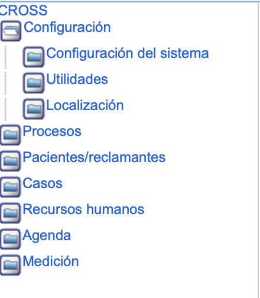

##################
Pantalla principal
##################

La pantalla Principal está compuesta por tres zonas. 

==============================
1. Barra de Opciones Generales 
==============================

La Barra de Opciones Generales presenta tres botones de funciones básicas como son: 
"Contacto", "Ayuda" y "Salir". 

+-------------------------------+-------------------------------------------------------+
|           Icono               |  Funcion                                              |
+===============================+=======================================================+
|                               | Para quitar o mostrar la barra lateral izquierda del  |
|.. image:: ../img/arbol.png    |                                                       |
|     :alt: Icono salir         | arbol, haga clic en este botón.                       |
|                               |                                                       |
+-------------------------------+-------------------------------------------------------+
|                               |                                                       |
|.. image:: ../img/mensaje.png  | Haciendo clic en este botón,le permitirá contactarse  |
|    :alt: Icono contato        |                                                       |
|                               | con el personal de soporte técnico de la aplicación.  |
|                               |                                                       |
+-------------------------------+-------------------------------------------------------+
|                               | Este botón le permitirá dirigirse a el manual de      |
|.. image:: ../img/libro.png    |                                                       |
|     :alt: Icono salir         | la aplicación.                                        |
|                               |                                                       |
+-------------------------------+-------------------------------------------------------+
|                               |  Este botón le permitirá activar la opción de ayuda   |                                        
|.. image:: ../img/pregunta.png |                                                       |
|     :alt: Icono ayuda         |  de la aplicación.                                    |
|                               |                                                       |
+-------------------------------+-------------------------------------------------------+
|                               | Para realizar una salida segura de la aplicación,     |
|.. image:: ../img/x.png        |                                                       |
|     :alt: Icono salir         | haga clic en este botón.                              |
|                               |                                                       |
+-------------------------------+-------------------------------------------------------+

===================
2. Menu de Opciones  
===================
.. |carpeta| image:: ../img/carpeta.jpg 
    :alt: Icono carpeta

El menú de opciones de esta aplicación contiene siete (7) aplicativos, los cuales se despliegan 
haciendo clic en el ícono |carpeta| que acompaña a cada aplicativo.

=====================
3. Zona de contenidos  
=====================

La zona de contenidos está compuesta por dos (2) elementos que son: 

1. Tabla de Descripción, la cual muestra brevemente el funcionamiento del capítulo. 
   Por Ejemplo: en "Casos > Registro > Administracion de tareas". del aplicativo "Casos", aparece esta tabla:

2. Formulario de registro, el cual consta de campos que deben de ser diligenciados por el 
   usuario. Por Ejemplo: en "Administración de tareas". del aplicativo "Casos" aparece este 
   formulario.

