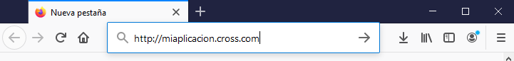
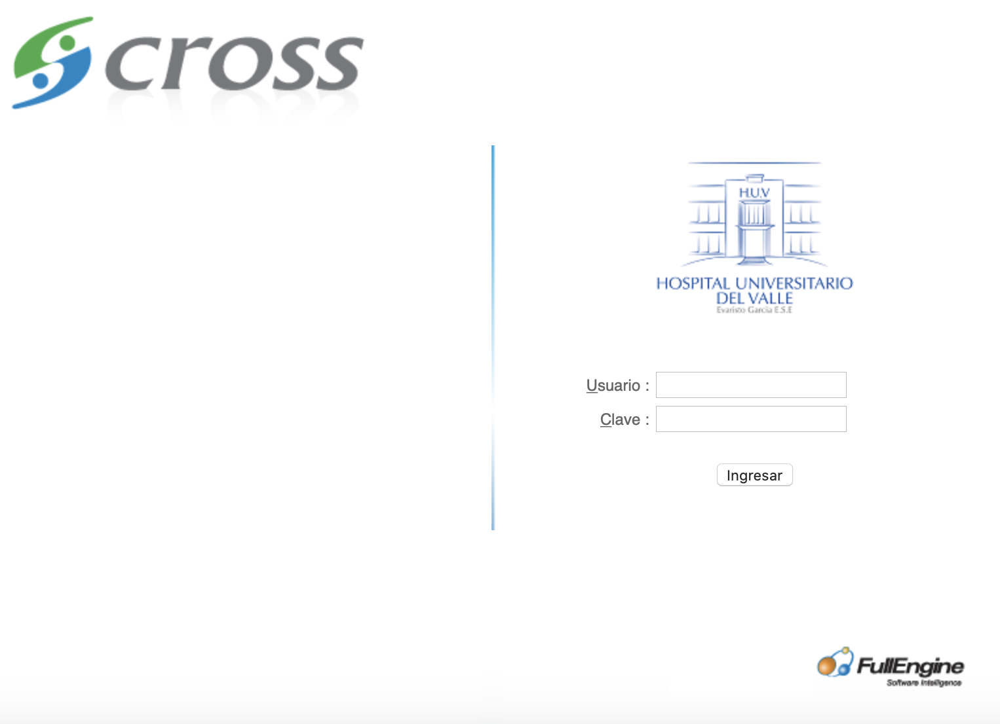

###################
Ingresar al sistema 
###################

*CROSSH Versión 3.0* es una aplicación diseñada para un entorno web y por tanto requiere el uso de un 
navegador web para su funcionamiento.

Para ingresar al sistema, siga los pasos indicados a continuación:

1. Inicie su navegador de internet (Haciendo doble click sobre alguno de los iconos en su 
   escritorio como los que se muestran abajo). 

.. image:: img/chrome.png
    :alt: Icono chrome

.. image:: img/edgenew.jpg
    :alt: Icono edge

2. Digite en la barra de direcciones de su navegador, la dirección URL que corresponda a la 
   página de acceso al sistema. Por ejemplo http://miaplicacion.cross.com. Esta acción 
   mostrará la pantalla de ingreso(tambien llamado login).

3. Se mostrará una pantalla como la siguiente.

4. Haga clic sobre la casilla “Usuario” y digite el nombre con el cual se encuentra 
   registrado en la aplicación. 

5. Digite en la casilla “Contraseña” su clave personal de acceso al sistema. Esta se mostrará 
   en asteriscos (*) o puntos por motivos de seguridad.

6. Haga clic sobre el botón ingresar que está al lado derecho de la casilla "contraseña".
   Tambien puede aparecer un icono como el que esta abajo.

    .. image:: img/ingresar.png 
        :alt: Boton login

   