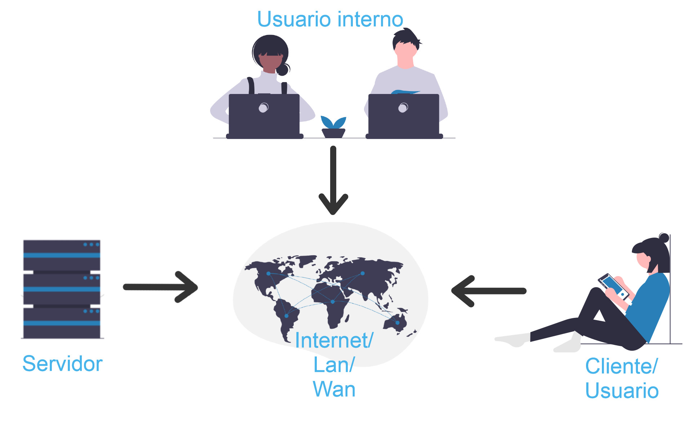

############
Introducción
############

====================
Acerca de FullEngine
====================

FullEngine es una empresa desarrolladora de software de alta calidad orientado a servicios, 
con una línea de producto especializada en aplicaciones de soporte para servicio al cliente.

En el desarrollo de sus productos, construye soluciones orientadas a la Web, facilitando su 
integración con sistemas existentes; utiliza plataformas de código abierto (open source), lo 
que reduce los costos de producción. Entre sus funciones está la de implantar productos 
multiplataforma de sistemas operacionales y almacenar la información en los motores de bases 
de datos líderes en el mercado, con el objetivo de minimizar la inversión de los clientes.

====================
Acerca de Cross
====================
Customer Relationship & Operative Services Support. Es una solución ideada para controlar 
los principales procesos involucrados en las relaciones Organización / cliente, que 
contribuye a la fidelización de los mismos y ayuda a mejorar significativamente el nivel de 
servicio al cliente, proporcionando valor agregado al servicio.

La aplicación contiene un work flow que le permitirá configurar cualquier proceso que se 
lleve a cabo en su empresa, atendiendo clientes internos y externos”.

La solución está basada en tecnología Web, fácilmente adaptable al sector económico y tamaño 
de cualquier empresa. Se desarrolla usando altos estándares de calidad e ingeniería de 
software, utilizando herramientas FreeWare de desarrollo de software como PHP y la base de 
datos PostgreSQL; esto permite que la solución alcance alta confiabilidad a bajo costo. Para 
facilitar el trabajo al usuario final, se usan interfaces gráficas intuitivas y soporte 
multi-lenguaje.

===========================
Beneficios de la aplicación
===========================
* Gestiona los eventos generados por el cliente.
* Ayuda a terminar las tareas en el tiempo previsto.
* Cuantifica resultados.
* Colabora en la optimización de la administración de los recursos humanos.
* Realiza control y seguimiento a procesos.
* Cuantifica tiempos por actividades y responsables.
* Disminuye costos.
* Mantiene información histórica de los clientes y los contratos.
* Establece la fecha probable de finalización del trabajo.
* Determina la agenda del personal.
* Mantiene un canal abierto de comunicación con los clientes.

=============================
Arquitectura de la aplicación
=============================

------------------
Modelo Tecnológico
------------------

El sistema CROSS ha sido concebido dentro del nuevo paradigma de las soluciones orientadas a 
la WEB, que pueden ser utilizadas usando la plataforma de Internet.

El sistema CROSS puede ser usado de manera convergente por varios usuarios en ambientes de 
Red Local (Intranet) y con usuarios fuera de la red local vía Internet (Extranet) o en 
ambientes Monousuario (Stand Alone).

-----------------------
Requerimientos técnicos
-----------------------

**Servidor:** 

* Memoria RAM: 512MB
* Disco duro: 500MB *Nota:* Considere tener más espacio disponible para el guardado de 
  archivos. 
* Servidor web: Apache o cualquiera que soporte el protocolo HTTP 1.0
* Sistema operativo: Linux Centos 7 o similares.

**Clientes:** 

* Memoria RAM y procesador para correr un navegador web compatible con Javascript 1.2 
  Java VM y HTML 4.0. 
