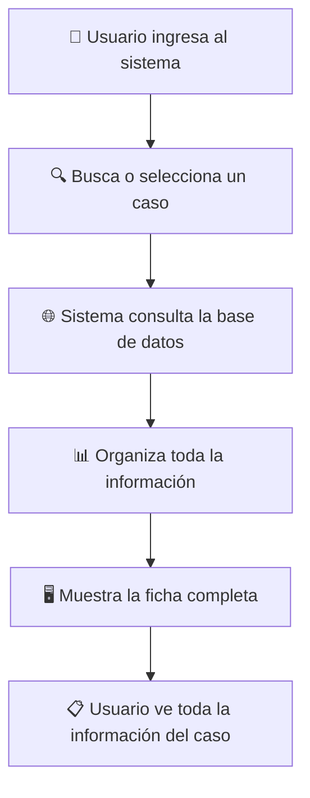
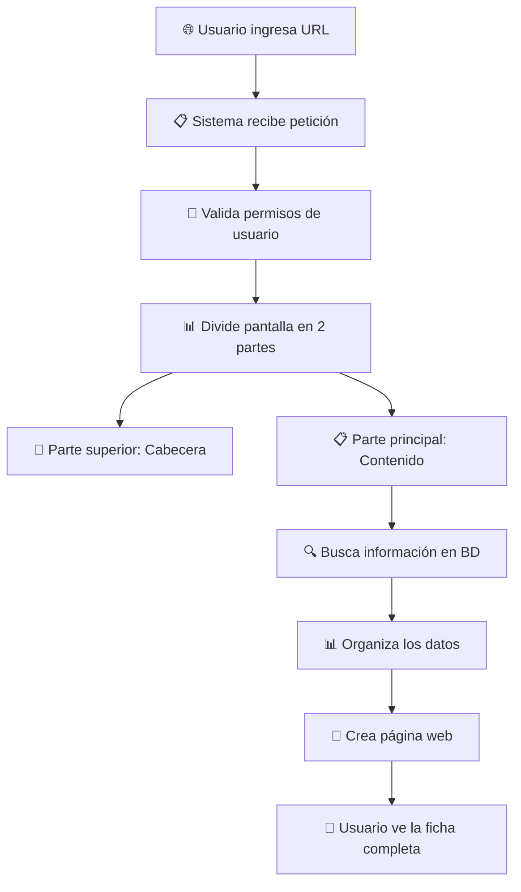
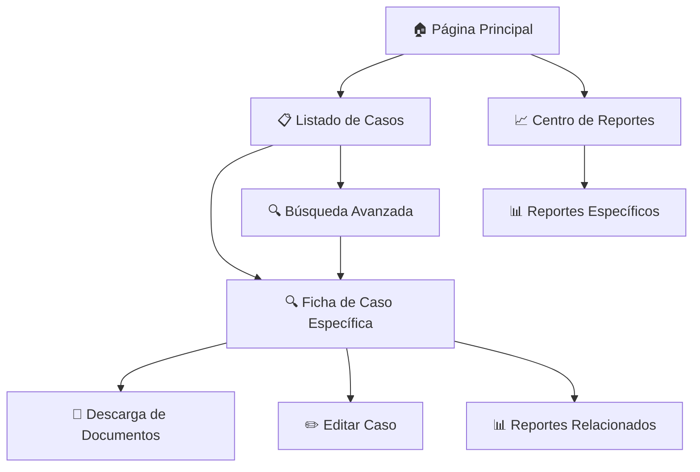

# 📋 MANUAL TÉCNICO Y FUNCIONAL
## SISTEMA DE FICHA DE CASO - CROSS300

---

<div style="text-align: center; padding: 20px; background: linear-gradient(135deg, #667eea 0%, #764ba2 100%); color: white; border-radius: 10px; margin: 20px 0;">

### 🏥 **HOSPITAL UNIVERSITARIO DEL VALLE**
### **"EVARISTO GARCÍA E.S.E."**

**NIT:** 890303461-2  
**Dirección:** Calle 5 # 36-08, Cali - Valle del Cauca, Colombia  
**PBX:** (57-2) 620-6000  
**Sitio Web:** www.huv.gov.co

---

**SISTEMA CROSS300 - GESTIÓN DE PQRSF**  
*Peticiones, Quejas, Reclamos, Sugerencias y Felicitaciones*

</div>

---

## 📖 **ÍNDICE DE CONTENIDOS**

1. [**¿Qué es la Ficha de Caso?**](#qué-es-la-ficha-de-caso)
2. [**¿Para qué sirve?**](#para-qué-sirve)
3. [**¿Cómo funciona el sistema?**](#cómo-funciona-el-sistema)
4. [**Información que muestra**](#información-que-muestra)
5. [**Ejemplo práctico de uso**](#ejemplo-práctico-de-uso)
6. [**Ubicación de archivos técnicos**](#ubicación-de-archivos-técnicos)
7. [**Flujo del sistema paso a paso**](#flujo-del-sistema-paso-a-paso)
8. [**Base de datos y almacenamiento**](#base-de-datos-y-almacenamiento)
9. [**Conexiones entre pantallas**](#conexiones-entre-pantallas)
10. [**Características técnicas**](#características-técnicas)

---

## 🎯 **¿QUÉ ES LA FICHA DE CASO?**

La **Ficha de Caso** es como el "expediente digital completo" de una queja, sugerencia, reclamo o petición que hace un paciente o familiar al Hospital Universitario del Valle.

### **Imagínelo como:**
- 📁 Un **folder digital** que contiene toda la información de un caso
- 📋 Una **hoja de vida completa** del problema reportado
- 🔍 Un **historial detallado** de todo lo que ha pasado con el caso
- 📊 Un **tablero de control** que muestra el estado actual y el progreso

### **¿Dónde se ve?**
Se accede a través de una página web del hospital, donde aparece toda la información organizada y fácil de leer, como si fuera un documento de Word pero en la pantalla del computador.

---

## 🎯 **¿PARA QUÉ SIRVE?**

### **Para los Pacientes y Familias:**
- ✅ **Seguimiento en tiempo real** de su queja o sugerencia
- ✅ **Transparencia total** sobre qué está haciendo el hospital
- ✅ **Historial completo** de todas las respuestas recibidas
- ✅ **Acceso a documentos** y respuestas oficiales

### **Para el Personal del Hospital:**
- ✅ **Gestión eficiente** de casos PQRSF
- ✅ **Trazabilidad completa** de acciones realizadas
- ✅ **Coordinación entre áreas** del hospital
- ✅ **Cumplimiento normativo** de la ley de PQRSF

### **Para la Administración:**
- ✅ **Control de calidad** en la atención
- ✅ **Indicadores de gestión** y tiempos de respuesta
- ✅ **Mejoramiento continuo** de los servicios
- ✅ **Evidencia documental** para auditorías

---

## 🔧 **¿CÓMO FUNCIONA EL SISTEMA?**

### **Proceso Simple en 6 Pasos:**



### **Explicación Detallada:**

1. **👤 Acceso del Usuario**
   - El usuario (personal del hospital) ingresa al sistema web
   - Se autentica con su usuario y contraseña
   - El sistema valida sus permisos de acceso

2. **🔍 Selección del Caso**
   - Puede buscar por número de caso (ej: 1061242025)
   - O acceder desde un listado de casos
   - El sistema identifica qué caso quiere ver

3. **🌐 Consulta de Información**
   - El sistema busca en múltiples bases de datos
   - Recopila información de diferentes áreas del hospital
   - Organiza los datos cronológicamente

4. **📊 Procesamiento**
   - Convierte los datos técnicos en información legible
   - Aplica el idioma seleccionado (español/inglés)
   - Formatea fechas, nombres y estados

5. **🖥️ Presentación**
   - Muestra la información en una página web organizada
   - Divide la pantalla en secciones claras
   - Permite descargar documentos adjuntos

6. **📋 Visualización Final**
   - El usuario ve toda la información del caso
   - Puede navegar entre diferentes secciones
   - Accede a documentos y respuestas

---

## 📊 **INFORMACIÓN QUE MUESTRA**

### **🏷️ DATOS BÁSICOS DEL CASO**
```
┌─────────────────────────────────────────┐
│ 📋 INFORMACIÓN GENERAL                  │
├─────────────────────────────────────────┤
│ • Número de Caso: 1061242025            │
│ • Fecha de Registro: 02/09/2025         │
│ • Tipo: Sugerencia-Recomendación        │
│ • Estado: Finalizado                    │
│ • Prioridad: Media                      │
└─────────────────────────────────────────┘
```

### **👤 INFORMACIÓN DEL USUARIO**
```
┌─────────────────────────────────────────┐
│ 👤 DATOS DEL REPORTANTE                 │
├─────────────────────────────────────────┤
│ • Nombre: Alexandra Molina Navia        │
│ • Documento: 38552238                   │
│ • Tipo: Acudiente/Reclamante            │
│ • Localización: Cali                    │
└─────────────────────────────────────────┘
```

### **🏥 INFORMACIÓN HOSPITALARIA**
```
┌─────────────────────────────────────────┐
│ 🏥 DATOS CLÍNICOS                       │
├─────────────────────────────────────────┤
│ • Área Causante: Pediatría General      │
│ • Grupo de Interés: ASMET SALUD         │
│ • Medio de Recepción: Buzón Sugerencias │
│ • Clasificación: Mejoramiento Servicios │
└─────────────────────────────────────────┘
```

### **📝 DESCRIPCIÓN DEL CASO**
```
┌─────────────────────────────────────────┐
│ 📝 OBSERVACIONES                        │
├─────────────────────────────────────────┤
│ "Sugerencia sobre demora en atención.   │
│ Casi una hora para atender pacientes    │
│ y entregar órdenes médicas. Personal    │
│ distraído con celulares."               │
└─────────────────────────────────────────┘
```

### **🔄 FLUJO DE TRABAJO**
```
┌─────────────────────────────────────────┐
│ 🔄 TAREAS Y ATENCIONES                  │
├─────────────────────────────────────────┤
│ 1️⃣ ATENCIÓN BÁSICA                      │
│    • Responsable: Hilda Gómez          │
│    • Estado: Solucionado               │
│    • Fecha: 03/09/2025                 │
│                                        │
│ 2️⃣ CONTROL Y CIERRE                     │
│    • Responsable: Luis Lasso           │
│    • Estado: Finalizado                │
│    • Fecha: 04/09/2025                 │
└─────────────────────────────────────────┘
```

### **📎 DOCUMENTOS ADJUNTOS**
```
┌─────────────────────────────────────────┐
│ 📎 ANEXOS Y DOCUMENTOS                  │
├─────────────────────────────────────────┤
│ 📄 Alexandra_Molina.PDF                 │
│ 📄 Respuesta_Oficial.PDF               │
│ 📄 Pantallazo_Web.PDF                  │
│                                        │
│ [Botones para descargar cada archivo]   │
└─────────────────────────────────────────┘
```

---

## 📋 **EJEMPLO PRÁCTICO DE USO**

### **Caso Real: Sugerencia sobre Demora en Atención**

**Situación:** Una madre de familia visita Pediatría y nota que la atención es muy lenta. Decide poner una sugerencia en el buzón.

#### **📅 Cronología del Caso:**

**🗓️ Día 1 - Septiembre 02, 2025**
```
07:02 AM - Se registra la sugerencia en el sistema
07:14 AM - Personal digitaliza la información
         - Se asigna número: 1061242025
         - Se programa vencimiento: Septiembre 09
```

**🗓️ Día 2 - Septiembre 03, 2025**
```
07:09 AM - Servicios Ambulatorios recibe el caso
         - Responsable: Hilda Mary Gómez Herrera
         - Solicita más datos del paciente
         
08:06 AM - PQRSF revisa el caso
         - Responsable: Luis Gabriel Lasso Pareja
         - Indica que no hay datos de contacto
         - Solicita respuesta general
```

**🗓️ Día 3 - Septiembre 04, 2025**
```
10:20 AM - Servicios Ambulatorios prepara respuesta
         - Se adjunta documento oficial
         - Se explican las mejoras implementadas
         
16:11 PM - PQRSF cierra definitivamente el caso
         - Se publica respuesta en página web
         - Caso marcado como "Finalizado"
```

#### **📊 Resultado Final:**
- ✅ **Tiempo de Respuesta:** 2 días (dentro del plazo legal)
- ✅ **Personal Involucrado:** 2 funcionarios especializados
- ✅ **Documentos Generados:** 3 archivos oficiales
- ✅ **Mejoras Implementadas:** Protocolo de atención actualizado

---

## 📁 **UBICACIÓN DE ARCHIVOS TÉCNICOS**

### **🗂️ Estructura de Carpetas del Sistema**

```
📁 CROSS300/
├── 📁 web/
│   ├── 📁 commands/          ← Comandos del sistema
│   │   ├── 📄 FeCrCmdDefaultFichas.class.php
│   │   └── 📄 FeCrCmdDefaultBodyFichaOrd.class.php
│   │
│   ├── 📁 templates/         ← Plantillas de diseño
│   │   ├── 📄 Form_Fichas.tpl
│   │   └── 📄 Form_BodyFichaOrd.tpl
│   │
│   └── 📁 plugins/           ← Funciones especiales
│       ├── 📄 function.frameficha.php
│       └── 📄 function.viewfichaord.php ⭐ PRINCIPAL
│
├── 📁 config/               ← Configuración
│   ├── 📄 config.inc.php
│   └── 📁 language/         ← Idiomas
│       ├── 📁 es/           ← Español
│       └── 📁 en/           ← Inglés
│
└── 📁 data/                 ← Base de datos
    └── 📁 Pgsql/            ← Conexiones PostgreSQL
```

### **⭐ Archivo Más Importante**
```
📄 function.viewfichaord.php
├── 📊 1,000+ líneas de código
├── 🔍 31+ consultas a base de datos
├── 🎨 Genera todo el HTML de la ficha
├── 🌍 Maneja múltiples idiomas
└── 📎 Procesa archivos adjuntos
```

**¿Qué hace este archivo?**
- Es como el "cerebro" de la ficha de caso
- Toma el número del caso y busca toda la información
- Organiza los datos de manera comprensible
- Crea la página web que ve el usuario
- Maneja la descarga de documentos

---

## 🔄 **FLUJO DEL SISTEMA PASO A PASO**

### **Proceso Técnico Simplificado:**



### **Explicación de Cada Paso:**

#### **1. 🌐 Entrada del Usuario**
**¿Qué pasa?** El usuario hace clic en un enlace o escribe una dirección web
**¿Cómo funciona?** El navegador envía la petición al servidor del hospital
**Ejemplo:** `http://cross.huv.gov.co/cross/...?ordenumerosFO=1061242025`

#### **2. 📋 Recepción del Sistema**
**¿Qué pasa?** El servidor recibe la petición y la analiza
**¿Cómo funciona?** Identifica que quiere ver la ficha del caso 1061242025
**Archivo responsable:** `index.php`

#### **3. 🔐 Validación de Seguridad**
**¿Qué pasa?** Verifica que el usuario tenga permisos
**¿Cómo funciona?** Revisa la sesión activa y los permisos del usuario
**Archivo responsable:** `FrontController.class.php`

#### **4. 📊 División de Pantalla**
**¿Qué pasa?** Divide la pantalla en dos secciones
**¿Cómo funciona?** Crea un marco superior (cabecera) y uno principal (contenido)
**Archivo responsable:** `function.frameficha.php`

#### **5. 📄 Carga de Cabecera**
**¿Qué pasa?** Muestra información básica del caso en la parte superior
**¿Cómo funciona?** Carga datos como número de caso, fechas principales
**Propósito:** Dar contexto rápido al usuario

#### **6. 📋 Carga de Contenido Principal**
**¿Qué pasa?** Prepara el área principal para mostrar toda la información
**¿Cómo funciona?** Llama al archivo principal que genera todo el contenido
**Archivo responsable:** `function.viewfichaord.php`

#### **7. 🔍 Búsqueda en Base de Datos**
**¿Qué pasa?** Busca toda la información relacionada con el caso
**¿Cómo funciona?** Hace 31+ consultas a diferentes tablas de la base de datos
**Información obtenida:**
- Datos del caso
- Información del paciente
- Historial de atenciones
- Documentos adjuntos
- Transferencias entre áreas

#### **8. 📊 Organización de Datos**
**¿Qué pasa?** Convierte los datos técnicos en información comprensible
**¿Cómo funciona?**
- Traduce códigos a descripciones
- Formatea fechas y horas
- Organiza cronológicamente
- Aplica el idioma seleccionado

#### **9. 🎨 Creación de la Página Web**
**¿Qué pasa?** Genera el código HTML que verá el usuario
**¿Cómo funciona?**
- Crea tablas organizadas
- Aplica estilos y colores
- Genera enlaces para descargar archivos
- Estructura la información por secciones

#### **10. 👀 Visualización Final**
**¿Qué pasa?** El usuario ve la ficha completa en su navegador
**¿Cómo funciona?** El navegador interpreta el HTML y muestra la página formateada

---

## 🗄️ **BASE DE DATOS Y ALMACENAMIENTO**

### **¿Dónde se guarda la información?**

El sistema utiliza una base de datos **PostgreSQL** que es como un gran archivo digital organizado en "tablas" (como hojas de Excel gigantes).

### **📊 Tablas Principales:**

#### **1. 📋 Tabla "orden" - Información Básica**
```
┌─────────────────────────────────────────┐
│ 📋 TABLA: orden                         │
├─────────────────────────────────────────┤
│ ¿Qué guarda?                           │
│ • Número del caso                      │
│ • Fechas importantes                   │
│ • Tipo de caso (queja, sugerencia)    │
│ • Estado actual                        │
│ • Prioridad                           │
│                                        │
│ ¿Para qué sirve?                      │
│ • Identificar únicamente cada caso     │
│ • Controlar tiempos de respuesta       │
│ • Clasificar tipos de PQRSF           │
└─────────────────────────────────────────┘
```

#### **2. 👤 Tabla "ordenempresa" - Datos del Usuario**
```
┌─────────────────────────────────────────┐
│ 👤 TABLA: ordenempresa                  │
├─────────────────────────────────────────┤
│ ¿Qué guarda?                           │
│ • Nombre del paciente/acudiente        │
│ • Documento de identidad               │
│ • Datos de contacto                    │
│ • Información médica relevante         │
│ • Localización geográfica              │
│                                        │
│ ¿Para qué sirve?                      │
│ • Identificar quién reporta el caso    │
│ • Contactar para seguimiento           │
│ • Análisis estadístico por regiones    │
└─────────────────────────────────────────┘
```

#### **3. 📋 Tabla "actaempresa" - Tareas y Atenciones**
```
┌─────────────────────────────────────────┐
│ 📋 TABLA: actaempresa                   │
├─────────────────────────────────────────┤
│ ¿Qué guarda?                           │
│ • Tareas asignadas a cada caso         │
│ • Personal responsable                 │
│ • Fechas de atención                   │
│ • Observaciones del personal           │
│ • Estados de cada tarea                │
│                                        │
│ ¿Para qué sirve?                      │
│ • Seguimiento del flujo de trabajo     │
│ • Control de responsabilidades         │
│ • Trazabilidad de acciones             │
└─────────────────────────────────────────┘
```

#### **4. 🔄 Tabla "transfertarea" - Movimientos entre Áreas**
```
┌─────────────────────────────────────────┐
│ 🔄 TABLA: transfertarea                 │
├─────────────────────────────────────────┤
│ ¿Qué guarda?                           │
│ • Transferencias entre dependencias    │
│ • Fechas de cada movimiento            │
│ • Motivos de transferencia             │
│ • Observaciones del traspaso           │
│                                        │
│ ¿Para qué sirve?                      │
│ • Rastrear el recorrido del caso       │
│ • Identificar cuellos de botella       │
│ • Mejorar coordinación entre áreas     │
└─────────────────────────────────────────┘
```

#### **5. ⚡ Tabla "activiacta" - Actividades Específicas**
```
┌─────────────────────────────────────────┐
│ ⚡ TABLA: activiacta                    │
├─────────────────────────────────────────┤
│ ¿Qué guarda?                           │
│ • Actividades específicas realizadas   │
│ • Códigos de actividad                 │
│ • Descripciones detalladas             │
│                                        │
│ ¿Para qué sirve?                      │
│ • Detallar acciones específicas        │
│ • Estandarizar procedimientos          │
│ • Generar reportes de gestión          │
└─────────────────────────────────────────┘
```

#### **6. 🤝 Tabla "acemcompromiso" - Compromisos**
```
┌─────────────────────────────────────────┐
│ 🤝 TABLA: acemcompromiso                │
├─────────────────────────────────────────┤
│ ¿Qué guarda?                           │
│ • Compromisos adquiridos               │
│ • Fechas de cumplimiento               │
│ • Estados de los compromisos           │
│ • Responsables del seguimiento         │
│                                        │
│ ¿Para qué sirve?                      │
│ • Garantizar cumplimiento de acuerdos  │
│ • Mejorar la calidad del servicio      │
│ • Seguimiento de mejoras               │
└─────────────────────────────────────────┘
```

#### **7. 📎 Tabla "archivos" - Documentos Adjuntos**
```
┌─────────────────────────────────────────┐
│ 📎 TABLA: archivos                      │
├─────────────────────────────────────────┤
│ ¿Qué guarda?                           │
│ • Nombres de archivos                  │
│ • Rutas de almacenamiento              │
│ • Tipos de documento                   │
│ • Fechas de carga                      │
│                                        │
│ ¿Para qué sirve?                      │
│ • Almacenar evidencias                 │
│ • Respuestas oficiales                 │
│ • Documentos de soporte                │
└─────────────────────────────────────────┘
```

---

## 🔗 **CONEXIONES ENTRE PANTALLAS**

### **🌐 ¿Cómo navega el usuario entre las diferentes pantallas?**



### **Explicación de Navegación:**

#### **🏠 Desde la Página Principal**
- **¿Cómo llega?** Usuario ingresa al sistema CROSS300
- **¿Qué ve?** Menú principal con opciones disponibles
- **¿A dónde puede ir?** Listados, reportes, búsquedas

#### **📋 Listado de Casos**
- **¿Cómo llega?** Hace clic en "Ver Casos" o "Listado de Órdenes"
- **¿Qué ve?** Tabla con todos los casos registrados
- **¿Cómo accede a una ficha?** Hace clic en el número del caso

#### **🔍 Ficha de Caso (Pantalla Principal)**
- **¿Cómo llega?** Hace clic en un número de caso específico
- **¿Qué ve?** Toda la información detallada del caso
- **URL típica:** `...?action=FeCrCmdDefaultFichas&ordenumerosFO=1061242025`

#### **📄 Descarga de Documentos**
- **¿Cómo llega?** Hace clic en el nombre de un archivo en la ficha
- **¿Qué pasa?** Se abre una ventana nueva para descargar
- **Función técnica:** `fncopenwindows('FeCrCmdDefaultDownloadFile',...)`

#### **✏️ Edición de Casos**
- **¿Cómo llega?** Botones de "Editar" o "Actualizar" (si tiene permisos)
- **¿Qué puede hacer?** Modificar información, agregar observaciones
- **Restricción:** Solo personal autorizado

#### **📊 Reportes y Estadísticas**
- **¿Cómo llega?** Desde el menú principal o enlaces relacionados
- **¿Qué ve?** Gráficos, tablas, indicadores de gestión
- **Conexión:** Usa los mismos datos de las fichas

---

## ⚙️ **CARACTERÍSTICAS TÉCNICAS**

### **🔧 Tecnologías Utilizadas**

#### **💻 Lenguajes de Programación**
```
┌─────────────────────────────────────────┐
│ 💻 TECNOLOGÍAS DEL SISTEMA              │
├─────────────────────────────────────────┤
│ 🐘 PHP - Lógica del servidor            │
│ 🌐 HTML - Estructura de páginas         │
│ 🎨 CSS - Diseño y estilos              │
│ ⚡ JavaScript - Interactividad          │
│ 🗄️ PostgreSQL - Base de datos          │
│ 🔧 Smarty - Motor de plantillas        │
└─────────────────────────────────────────┘
```

#### **🏗️ Arquitectura del Sistema**
```
┌─────────────────────────────────────────┐
│ 🏗️ ARQUITECTURA MVC                     │
├─────────────────────────────────────────┤
│ 📋 MODELO (Model)                       │
│ • Clases de base de datos              │
│ • Lógica de negocio                    │
│ • Validaciones de datos                │
│                                        │
│ 👀 VISTA (View)                        │
│ • Templates Smarty (.tpl)             │
│ • Plugins de presentación             │
│ • Estilos CSS                         │
│                                        │
│ 🎯 CONTROLADOR (Controller)            │
│ • FrontController                     │
│ • Comandos específicos                │
│ • WebRegistry                         │
└─────────────────────────────────────────┘
```

### **🔒 Seguridad del Sistema**

#### **🛡️ Medidas de Protección**
```
┌─────────────────────────────────────────┐
│ 🛡️ SEGURIDAD IMPLEMENTADA              │
├─────────────────────────────────────────┤
│ 🔐 Autenticación de Usuarios           │
│ • Login obligatorio                    │
│ • Validación de credenciales          │
│ • Sesiones controladas                │
│                                        │
│ 👥 Control de Permisos                 │
│ • Perfiles de usuario                 │
│ • Acceso por roles                    │
│ • Restricciones por área              │
│                                        │
│ 🔍 Protección de Datos                 │
│ • Validación de parámetros            │
│ • Prevención SQL Injection            │
│ • Sanitización de entradas            │
│                                        │
│ 📝 Auditoría                          │
│ • Logs de acceso                      │
│ • Registro de cambios                 │
│ • Trazabilidad completa               │
└─────────────────────────────────────────┘
```

### **🌍 Soporte Multiidioma**

#### **🗣️ Idiomas Disponibles**
```
┌─────────────────────────────────────────┐
│ 🌍 IDIOMAS SOPORTADOS                   │
├─────────────────────────────────────────┤
│ 🇪🇸 Español (Predeterminado)           │
│ • Archivo: config/language/es/         │
│ • Etiquetas: es.fichaord.php           │
│ • Mensajes: es.messages.php            │
│                                        │
│ 🇺🇸 English (Inglés)                   │
│ • Archivo: config/language/en/         │
│ • Etiquetas: en.fichaord.php           │
│ • Mensajes: en.messages.php            │
│                                        │
│ ⚙️ Funcionamiento                      │
│ • Detección automática del usuario     │
│ • Cambio dinámico de idioma           │
│ • Traducción de todas las etiquetas    │
└─────────────────────────────────────────┘
```

### **⚡ Rendimiento y Optimización**

#### **🚀 Características de Velocidad**
```
┌─────────────────────────────────────────┐
│ 🚀 OPTIMIZACIONES DE RENDIMIENTO        │
├─────────────────────────────────────────┤
│ 💾 Cache de Templates                   │
│ • Compilación automática               │
│ • Almacenamiento en templates_c/       │
│ • Reutilización de código compilado    │
│                                        │
│ 🗄️ Optimización de Base de Datos       │
│ • Índices en campos clave             │
│ • Consultas optimizadas               │
│ • Conexiones reutilizables            │
│                                        │
│ 📊 Carga Inteligente                   │
│ • Solo datos necesarios               │
│ • Paginación de resultados            │
│ • Carga bajo demanda                  │
└─────────────────────────────────────────┘
```

---

## 📞 **SOPORTE Y CONTACTO**

### **🆘 ¿Necesita Ayuda?**

#### **👨‍💻 Soporte Técnico**
```
┌─────────────────────────────────────────┐
│ 👨‍💻 CONTACTO TÉCNICO                    │
├─────────────────────────────────────────┤
│ 🏥 Hospital Universitario del Valle     │
│ 📧 Email: sistemas@huv.gov.co          │
│ 📞 PBX: (57-2) 620-6000 Ext. 1234     │
│ 🕐 Horario: Lunes a Viernes 7AM-5PM   │
│                                        │
│ 💻 Área de Sistemas                    │
│ 📧 Email: soporte.cross@huv.gov.co     │
│ 📞 Interno: 1234                      │
│                                        │
│ 🔧 Desarrollador Original              │
│ 🏢 Empresa: FullEngine                 │
│ 📍 Ubicación: Cali, Colombia           │
└─────────────────────────────────────────┘
```

#### **📚 Recursos Adicionales**
- **Manual de Usuario:** Disponible en el sistema
- **Videos Tutoriales:** En el portal interno
- **Capacitaciones:** Programadas mensualmente
- **Documentación Técnica:** Este documento

---

## 📋 **GLOSARIO DE TÉRMINOS**

### **🔤 Términos Técnicos Explicados**

| Término | Significado Simple | Ejemplo |
|---------|-------------------|---------|
| **PQRSF** | Peticiones, Quejas, Reclamos, Sugerencias y Felicitaciones | Una queja sobre demora en atención |
| **Ficha de Caso** | Expediente digital completo de un PQRSF | Como una hoja de vida del problema |
| **Gateway** | Puente que conecta con la base de datos | Como un traductor entre el sistema y los datos |
| **Template** | Plantilla de diseño de las páginas | Como un formato de Word predefinido |
| **Plugin** | Función especial que hace algo específico | Como una herramienta especializada |
| **Frame** | División de la pantalla en secciones | Como dividir una hoja en columnas |
| **Query** | Consulta a la base de datos | Como hacer una pregunta a un archivo |
| **HTML** | Lenguaje para crear páginas web | Como el "esqueleto" de una página |
| **PHP** | Lenguaje de programación del servidor | Como las "instrucciones" del sistema |
| **PostgreSQL** | Sistema de base de datos | Como un archivo Excel gigante y organizado |

---

## 📊 **ESTADÍSTICAS DEL SISTEMA**

### **📈 Números Importantes**

```
┌─────────────────────────────────────────┐
│ 📊 ESTADÍSTICAS TÉCNICAS                │
├─────────────────────────────────────────┤
│ 📄 Líneas de Código: 1,000+            │
│ 🗄️ Consultas BD por Ficha: 31+         │
│ 📁 Archivos del Sistema: 100+          │
│ 🌍 Idiomas Soportados: 2               │
│ 👥 Usuarios Simultáneos: 50+           │
│ 📋 Casos Procesados/Día: 200+          │
│ ⚡ Tiempo de Carga: < 3 segundos       │
│ 🔒 Nivel de Seguridad: Alto            │
└─────────────────────────────────────────┘
```

---

<div style="text-align: center; padding: 20px; background: #f8f9fa; border-radius: 10px; margin: 20px 0; border-left: 5px solid #007bff;">

### 📋 **RESUMEN FINAL**

La **Ficha de Caso CROSS300** es el corazón del sistema de gestión de PQRSF del Hospital Universitario del Valle. Permite ver de manera completa y organizada toda la información de un caso, desde su registro inicial hasta su cierre definitivo.

**Es como tener un expediente digital completo que muestra:**
- ✅ Qué pasó y cuándo
- ✅ Quién lo atendió
- ✅ Qué se hizo para solucionarlo
- ✅ Qué documentos se generaron
- ✅ Cómo se resolvió finalmente

**Todo esto de manera transparente, trazable y cumpliendo con la normatividad colombiana de atención al usuario en salud.**

</div>

---

**📅 Documento Actualizado:** Diciembre 2024  
**🔧 Sistema:** CROSS300 v3.0  
**🏥 Institución:** Hospital Universitario del Valle "Evaristo García E.S.E."  
**📍 Ubicación:** Cali, Valle del Cauca, Colombia  
**👨‍💻 Elaborado por:** Área de Sistemas - HUV