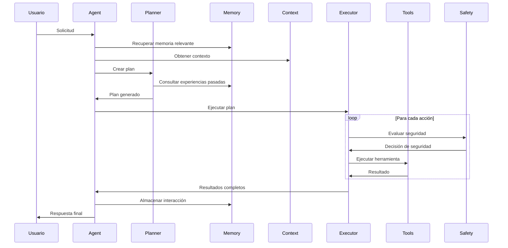
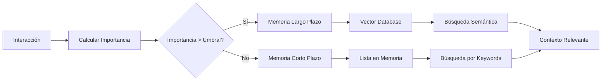

# Arquitectura Técnica Detallada

## Visión General

El agente local está diseñado como un sistema modular y extensible que replica las capacidades de agentes de IA avanzados como Augment Agent. La arquitectura sigue principios de separación de responsabilidades, seguridad por diseño y extensibilidad.

## Componentes Principales

### 1. Core Agent Engine

#### Task Planner (`core/planner.py`)
**Responsabilidad**: Convierte solicitudes de usuario en planes ejecutables

**Flujo de trabajo**:
1. Recibe solicitud del usuario
2. Consulta memoria y contexto relevante
3. Analiza herramientas disponibles
4. Genera plan estructurado con dependencias
5. Evalúa riesgo y necesidad de confirmación

**Algoritmo de planificación**:
```python
def create_plan(user_request, context, tools):
    # 1. Análisis semántico de la solicitud
    intent = analyze_intent(user_request)
    
    # 2. Descomposición en subtareas
    subtasks = decompose_request(intent, context)
    
    # 3. Mapeo a herramientas disponibles
    actions = map_to_tools(subtasks, tools)
    
    # 4. Resolución de dependencias
    ordered_actions = resolve_dependencies(actions)
    
    # 5. Evaluación de riesgo
    risk_level = evaluate_risk(ordered_actions)
    
    return ExecutionPlan(actions, risk_level)
```

#### Action Executor (`core/executor.py`)
**Responsabilidad**: Ejecuta planes de forma segura y controlada

**Características clave**:
- Ejecución secuencial con soporte para paralelismo
- Validación de seguridad antes de cada acción
- Manejo de timeouts y errores
- Integración con human-in-the-loop
- Logging detallado de todas las operaciones

**Flujo de ejecución**:
```python
async def execute_plan(plan):
    for action in plan.actions:
        # 1. Verificar guardrails
        safety_check = await safety.evaluate_action(action)
        
        # 2. Solicitar confirmación si es necesario
        if safety_check.requires_confirmation:
            approved = await human_loop.request_confirmation(action)
            if not approved:
                continue
        
        # 3. Ejecutar acción con timeout
        result = await execute_with_timeout(action)
        
        # 4. Registrar resultado
        log_execution_result(action, result)
```

#### Memory Manager (`core/memory.py`)
**Responsabilidad**: Gestiona memoria a corto y largo plazo

**Tipos de memoria**:
- **Memoria a corto plazo**: Conversación actual, variables de sesión
- **Memoria a largo plazo**: Conocimientos persistentes, preferencias del usuario
- **Memoria de trabajo**: Estado temporal durante ejecución de tareas

**Algoritmo de importancia**:
```python
def calculate_importance(interaction):
    factors = {
        'success_rate': 0.3,
        'complexity': 0.2, 
        'user_feedback': 0.2,
        'error_learning': 0.15,
        'novelty': 0.15
    }
    
    score = sum(factor * weight for factor, weight in factors.items())
    return min(max(score, 0.0), 1.0)
```

#### Context Engine (`core/context.py`)
**Responsabilidad**: Mantiene y recupera contexto relevante

**Estrategias de recuperación**:
- Búsqueda semántica con embeddings
- Filtrado temporal (recencia)
- Relevancia por tags y metadatos
- Contexto de sesión actual

### 2. Tool System

#### Tool Registry (`tools/registry.py`)
**Responsabilidad**: Registro y gestión de herramientas

**Características**:
- Registro dinámico de herramientas
- Validación de definiciones
- Carga lazy de herramientas pesadas
- Versionado de herramientas
- Métricas de uso

#### Herramientas Base (`tools/base.py`)
**Patrón de diseño**: Template Method + Strategy

**Estructura de herramienta**:
```python
class BaseTool(ABC):
    @abstractmethod
    async def execute(self, parameters) -> Dict[str, Any]:
        """Lógica principal de la herramienta"""
        pass
    
    @abstractmethod
    def get_definition(self) -> ToolDefinition:
        """Definición de la herramienta para el planner"""
        pass
    
    def validate_parameters(self, params) -> Dict[str, Any]:
        """Validación de parámetros de entrada"""
        pass
```

### 3. Safety & Control Layer

#### Safety Guardrails (`safety/guardrails.py`)
**Responsabilidad**: Evaluación de seguridad antes de ejecución

**Tipos de reglas**:
- **Reglas de patrón**: Regex para detectar comandos peligrosos
- **Reglas de contexto**: Evaluación basada en estado del sistema
- **Reglas de usuario**: Configuraciones específicas del usuario
- **Reglas adaptativas**: Aprendizaje de patrones de riesgo

#### Human-in-the-Loop (`safety/human_loop.py`)
**Responsabilidad**: Intervención humana cuando es necesaria

**Tipos de intervención**:
- Confirmación de acciones de riesgo
- Aprobación de planes complejos
- Modificación de parámetros
- Supervisión en tiempo real

#### Sandbox (`safety/sandbox.py`)
**Responsabilidad**: Ejecución aislada de código y comandos

**Implementaciones soportadas**:
- Docker containers
- Firejail (Linux)
- Subprocess con restricciones
- Máquinas virtuales (futuro)

### 4. Storage Layer

#### Vector Database (`storage/vector_db.py`)
**Tecnología**: ChromaDB con embeddings de Sentence Transformers

**Colecciones**:
- `conversations`: Historial de interacciones
- `code_context`: Información de código y archivos
- `web_knowledge`: Datos obtenidos de internet
- `user_preferences`: Configuraciones del usuario

**Optimizaciones**:
- Indexación automática
- Compresión de embeddings
- Limpieza periódica de datos antiguos
- Backup incremental

#### SQL Database (`storage/sql_db.py`)
**Uso**: Metadatos estructurados, configuración, logs

**Esquema principal**:
```sql
-- Sesiones de usuario
CREATE TABLE sessions (
    id UUID PRIMARY KEY,
    user_id VARCHAR(255),
    created_at TIMESTAMP,
    last_activity TIMESTAMP,
    metadata JSONB
);

-- Ejecuciones de planes
CREATE TABLE plan_executions (
    id UUID PRIMARY KEY,
    session_id UUID REFERENCES sessions(id),
    plan_data JSONB,
    status VARCHAR(50),
    created_at TIMESTAMP,
    completed_at TIMESTAMP
);

-- Resultados de acciones
CREATE TABLE action_results (
    id UUID PRIMARY KEY,
    plan_execution_id UUID REFERENCES plan_executions(id),
    action_id VARCHAR(255),
    tool_name VARCHAR(255),
    status VARCHAR(50),
    result JSONB,
    error_message TEXT,
    execution_time FLOAT,
    created_at TIMESTAMP
);
```

## Flujos de Datos Detallados

### Flujo Principal de Procesamiento



### Flujo de Memoria



## Patrones de Diseño Utilizados

### 1. Strategy Pattern
**Uso**: Diferentes proveedores de LLM, tipos de herramientas
```python
class LLMProvider(ABC):
    @abstractmethod
    async def generate(self, prompt: str) -> str:
        pass

class OpenAIProvider(LLMProvider):
    async def generate(self, prompt: str) -> str:
        # Implementación específica de OpenAI
        pass
```

### 2. Observer Pattern
**Uso**: Logging, métricas, notificaciones
```python
class ExecutionObserver(ABC):
    @abstractmethod
    async def on_action_start(self, action: Action):
        pass
    
    @abstractmethod 
    async def on_action_complete(self, action: Action, result: Any):
        pass
```

### 3. Command Pattern
**Uso**: Acciones ejecutables, deshacer operaciones
```python
class Command(ABC):
    @abstractmethod
    async def execute(self) -> Any:
        pass
    
    @abstractmethod
    async def undo(self) -> Any:
        pass
```

### 4. Factory Pattern
**Uso**: Creación de herramientas, configuraciones
```python
class ToolFactory:
    @staticmethod
    def create_tool(tool_type: str, config: Dict) -> BaseTool:
        if tool_type == "file":
            return FileTools(config)
        elif tool_type == "system":
            return SystemTools(config)
        # ...
```

## Consideraciones de Rendimiento

### Optimizaciones Implementadas

1. **Lazy Loading**: Herramientas se cargan solo cuando se necesitan
2. **Caching**: Resultados de operaciones costosas se cachean
3. **Connection Pooling**: Pool de conexiones para bases de datos
4. **Async/Await**: Operaciones no bloqueantes en toda la aplicación
5. **Batch Processing**: Operaciones vectoriales en lotes

### Métricas de Rendimiento

- **Tiempo de respuesta objetivo**: < 2 segundos para solicitudes simples
- **Throughput**: 10-50 solicitudes/minuto dependiendo de complejidad
- **Memoria**: < 500MB para operación normal
- **Almacenamiento**: Crecimiento lineal con uso (~1MB/1000 interacciones)

## Escalabilidad

### Escalabilidad Horizontal
- Múltiples instancias del agente con balanceador de carga
- Base de datos compartida para memoria persistente
- Queue system para procesamiento asíncrono

### Escalabilidad Vertical
- Configuración de recursos por herramienta
- Límites de memoria y CPU por ejecución
- Optimización de embeddings y búsquedas vectoriales

## Seguridad en Profundidad

### Capas de Seguridad

1. **Input Validation**: Sanitización de todas las entradas
2. **Guardrails**: Reglas de seguridad configurables
3. **Sandboxing**: Ejecución aislada de código peligroso
4. **Human Oversight**: Confirmación para acciones críticas
5. **Audit Logging**: Registro completo de todas las acciones
6. **Resource Limits**: Límites de CPU, memoria y tiempo

### Modelo de Amenazas

**Amenazas consideradas**:
- Inyección de comandos maliciosos
- Acceso no autorizado a archivos del sistema
- Consumo excesivo de recursos
- Exfiltración de datos sensibles
- Modificación no autorizada de código

**Mitigaciones implementadas**:
- Whitelist de comandos permitidos
- Sandbox con capacidades limitadas
- Validación estricta de parámetros
- Logging completo para auditoría
- Timeouts para prevenir DoS

## Extensibilidad

### Añadir Nuevas Herramientas

```python
# 1. Crear clase que herede de BaseTool
class MyCustomTool(BaseTool):
    def get_definition(self) -> ToolDefinition:
        return ToolDefinition(
            name="my_tool",
            description="Mi herramienta personalizada",
            # ... resto de la definición
        )
    
    async def execute(self, parameters) -> Dict[str, Any]:
        # Lógica de la herramienta
        pass

# 2. Registrar en el sistema
tool_registry.register_tool(MyCustomTool())
```

### Añadir Nuevos Proveedores LLM

```python
class CustomLLMProvider(BaseLLMProvider):
    async def generate(self, prompt: str, **kwargs) -> str:
        # Implementación específica
        pass
    
    def get_model_info(self) -> Dict[str, Any]:
        return {
            "name": "custom_model",
            "max_tokens": 4096,
            "supports_streaming": True
        }
```

### Añadir Nuevas Interfaces

```python
class TelegramInterface(BaseInterface):
    async def handle_message(self, message: str, user_id: str):
        response = await self.agent.process_request(message)
        await self.send_telegram_message(user_id, response)
```

## Configuración Avanzada

### Variables de Entorno Críticas

```bash
# Configuración de seguridad
ENABLE_SANDBOX=true
REQUIRE_CONFIRMATION=true
MAX_EXECUTION_TIME=300
ALLOWED_PATHS="./,/tmp,~/Documents"

# Configuración de memoria
MEMORY_IMPORTANCE_THRESHOLD=0.3
MAX_SHORT_TERM_MEMORY=100
VECTOR_DB_PATH=./data/vector_db

# Configuración de rendimiento
MAX_WORKERS=4
CONNECTION_POOL_SIZE=10
CACHE_CLEANUP_INTERVAL=3600
```

### Configuración de Herramientas

```yaml
# config/tools.yml
tools:
  file_operations:
    enabled: true
    max_file_size: 10MB
    allowed_extensions: [".txt", ".py", ".js", ".md"]
    
  system_commands:
    enabled: true
    sandbox_required: true
    blocked_commands: ["rm -rf", "format", "shutdown"]
    
  web_tools:
    enabled: true
    max_requests_per_minute: 10
    blocked_domains: ["malware.com", "phishing.net"]
```

## Monitoreo y Observabilidad

### Métricas Clave

1. **Métricas de Rendimiento**:
   - Tiempo de respuesta promedio
   - Throughput de solicitudes
   - Uso de memoria y CPU
   - Latencia de herramientas

2. **Métricas de Calidad**:
   - Tasa de éxito de ejecuciones
   - Precisión de planificación
   - Satisfacción del usuario
   - Errores por tipo

3. **Métricas de Seguridad**:
   - Violaciones de guardrails
   - Acciones bloqueadas
   - Confirmaciones requeridas
   - Intentos de acceso no autorizado

### Logging Estructurado

```python
# Formato de logs
{
    "timestamp": "2024-01-15T10:30:00Z",
    "level": "INFO",
    "component": "executor",
    "action": "execute_tool",
    "tool_name": "read_file",
    "parameters": {"path": "example.py"},
    "execution_time": 0.15,
    "success": true,
    "session_id": "uuid-here",
    "user_id": "user123"
}
```

## Casos de Uso Avanzados

### 1. Desarrollo de Software Asistido
```python
# El agente puede:
# - Analizar código existente
# - Generar nuevas funciones
# - Ejecutar tests
# - Hacer refactoring
# - Gestionar dependencias

request = """
Analiza el archivo main.py, identifica problemas de rendimiento,
genera tests unitarios y ejecuta la suite de pruebas
"""
```

### 2. Automatización de DevOps
```python
# El agente puede:
# - Gestionar repositorios Git
# - Ejecutar pipelines CI/CD
# - Monitorear servicios
# - Gestionar configuraciones

request = """
Verifica el estado del repositorio, ejecuta los tests,
y si pasan, haz commit y push de los cambios
"""
```

### 3. Análisis de Datos
```python
# El agente puede:
# - Leer datasets
# - Ejecutar análisis estadísticos
# - Generar visualizaciones
# - Crear reportes

request = """
Analiza el archivo data.csv, genera estadísticas descriptivas
y crea un gráfico de las tendencias principales
"""
```

## Roadmap de Desarrollo

### Fase 1: MVP (4-6 semanas)
- [ ] Core engine básico
- [ ] 5-10 herramientas esenciales
- [ ] Interfaz CLI funcional
- [ ] Guardrails básicos
- [ ] Memoria simple

### Fase 2: Funcionalidad Completa (6-8 semanas)
- [ ] Sistema de memoria avanzado
- [ ] Sandboxing robusto
- [ ] Interfaz web
- [ ] API REST completa
- [ ] 20+ herramientas

### Fase 3: Producción (8-10 semanas)
- [ ] Monitoreo y métricas
- [ ] Escalabilidad horizontal
- [ ] Integración con IDEs
- [ ] Herramientas de administración
- [ ] Documentación completa

### Fase 4: Avanzado (12+ semanas)
- [ ] Agentes especializados
- [ ] Workflows complejos
- [ ] Integración con servicios externos
- [ ] Machine learning para optimización
- [ ] Marketplace de herramientas
